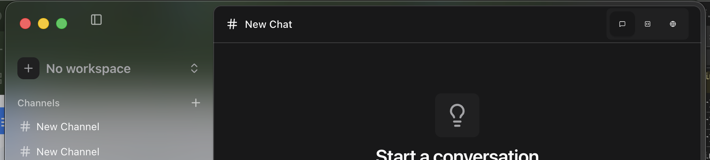

# Step 0: Installation

*Download, install, and first launch of Zephyr Agency*

### INST-01: Download

**Pre-condition:** Download link from Quick Start guide

| **Step** | **Action** | **Expected Result** | **Result** |
|----|----|----|----|
| 1 | Click the download link for your platform | Download starts in your browser | **P** |
| 2 | Wait for download to complete | File downloaded: .dmg (macOS), .msi/.exe (Windows), .AppImage/.deb (Linux) | **P** |
| 3 | Check the downloaded file size | File is not 0 bytes and appears complete | **P** |

<table>
<colgroup>
<col style="width: 100%" />
</colgroup>
<thead>
<tr>
<th>
<strong>Notes:</strong>

DMG app alias icon could be better positioned, but I know this is a CI caveat
</th>
</tr>
</thead>
<tbody>
</tbody>
</table>

### INST-02: Install — macOS

**Pre-condition:** INST-01 complete, .dmg file downloaded. Skip if not on macOS.

| **Step** | **Action** | **Expected Result** | **Result** |
|----|----|----|----|
| 1 | Double-click the .dmg file | Disk image mounts, Finder window opens | **P** |
| 2 | Drag Zephyr Agency to Applications folder | App copies to /Applications | **P** |
| 3 | Eject the disk image | Disk image unmounts cleanly | **P** |

| **Notes:** |
|------------|

### INST-03: Install — Windows

**Pre-condition:** INST-01 complete, installer downloaded. Skip if not on Windows.

| **Step** | **Action** | **Expected Result** | **Result** |
|----|----|----|----|
| 1 | Run the downloaded installer (.msi or .exe) | Installer window appears |  |
| 2 | Follow the installation prompts | Installation completes without errors |  |
| 3 | Check Start Menu or Desktop for shortcut | Shortcut is present |  |

| **Notes:** |
|------------|

### INST-04: Install — Linux

**Pre-condition:** INST-01 complete, package downloaded. Skip if not on Linux.

| **Step** | **Action** | **Expected Result** | **Result** |
|----|----|----|----|
| 1 | Install via package manager (.deb) or make AppImage executable | Installation completes or AppImage is executable |  |
| 2 | Verify app appears in launcher or can run from terminal | App is launchable |  |

| **Notes:** |
|------------|

### 

### 

### INST-05: First Launch

**Pre-condition:** Installation complete

| **Step** | **Action** | **Expected Result** | **Result** |
|----|----|----|----|
| 1 | Launch Zephyr Agency from applications | App begins to load | **P** |
| 2 | If macOS blocks: System Settings → Privacy & Security → Open Anyway | Security prompt clears, app launches | **P** |
| 3 | Wait for app window to appear | Main window visible within 10 seconds | **P** |
| 4 | Observe the window | Sidebar visible on left with navigation items | **P** |
| 5 | Look for Sign In option | Sign In button visible at bottom of sidebar | **P** |

<table>
<colgroup>
<col style="width: 100%" />
</colgroup>
<thead>
<tr>
<th>
<strong>Notes:</strong>

<strong><mark>BLOCKER</mark></strong>: not authenticated, collapsed sidebar, was not able to open again, sidebar open trigger became unresponsive. 
 
ADDITIONAL TEST: Open whilst offline, app opens, no errors or warnings
</th>
</tr>
</thead>
<tbody>
</tbody>
</table>

### 

### 

### 

### 

### 

### 

### 

### 

### 

### INST-06: Verify Installation

**Pre-condition:** App has launched successfully

| **Step** | **Action** | **Expected Result** | **Result** |
|----|----|----|----|
| 1 | Check app launched without crashing | Window appeared, no crash dialog | **P** |
| 2 | Observe sidebar | Left panel with navigation items is visible | **P** |
| 3 | Check for error dialogs | No modal errors or warnings on launch | **P** |
| 4 | Try resizing window | Window resizes smoothly | **P** |
| 5 | Try fullscreen | App enters and exits fullscreen cleanly | **P** |

<table>
<colgroup>
<col style="width: 100%" />
</colgroup>
<thead>
<tr>
<th>
<strong>Notes:</strong>

On Tahoe, sidebar has no background. Should it?

</th>
</tr>
</thead>
<tbody>
</tbody>
</table>
