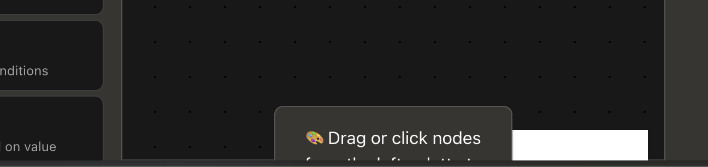
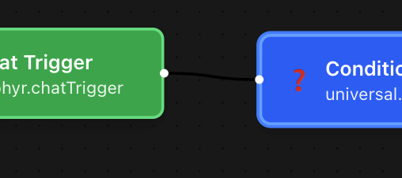
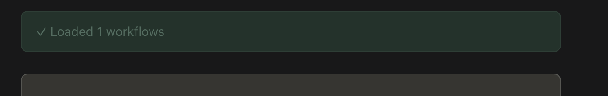

# Step 6: Workflows

*Visual workflow editor, n8n import, execution*

**Note:** The URL is /workflow (singular), not /workflows.

### WORK-01: Page Load

**Pre-condition:** Authenticated

| **Step** | **Action** | **Expected Result** | **Result** |
|----|----|----|----|
| 1 | Click Workflows in sidebar | URL shows /workflow (singular) | P |
| 2 | Observe page header | Shows Workflows with refresh and + buttons | P |
| 3 | Observe main content area | Shows workflow list or empty state with Quick Start | P |

| **Notes:** |
|------------|

### WORK-02: Empty State & Quick Start

**Pre-condition:** On /workflow, no workflows created

| **Step** | **Action** | **Expected Result** | **Result** |
|----|----|----|----|
| 1 | Observe left panel | No workflows yet message | P |
| 2 | Observe right panel | Quick Start guide visible | P |
| 3 | Observe Quick Start steps | 3 numbered steps shown | P |
| 4 | Read step 1 | Create Workflow - Click + to design | P |
| 5 | Read step 2 | Add Nodes - Drag nodes from palette | F |
| 6 | Read step 3 | Save & Execute - Save and test | P |

<table>
<colgroup>
<col style="width: 100%" />
</colgroup>
<thead>
<tr>
<th>
<strong>Notes:</strong>

</th>
</tr>
</thead>
<tbody>
</tbody>
</table>

### WORK-03: Visual Editor Launch

| **Step** | **Action** | **Expected Result** | **Result** |
|----|----|----|----|
| 1 | Click Visual Editor button | Editor opens | P |
| 2 | Observe migration prompt (may appear) | Enable Collaborative Editing dialog | ? |
| 3 | Dismiss or accept prompt | Click Skip for Now or Migrate Now | ? |
| 4 | Observe toolbar | Back, name field, Dataflow dropdown, New, Import, Export, Save, Execute | P |
| 5 | Observe Node Palette (left) | Triggers (4), Actions (20) categories | P |
| 6 | Observe canvas (center) | Drag or click nodes from the left | P |
| 7 | Locate Back button (top-left) | ← Back returns to workflow list | P |

<table>
<colgroup>
<col style="width: 100%" />
</colgroup>
<thead>
<tr>
<th>
<strong>Notes:</strong>

<strong>Drag and drop is a bit janky. Click works better.</strong>

<strong>Double click (which is intuitive) creates TWO nodes on top of each other, suggest a slight offset so that the user can see that double-clicking is not the right gesture.</strong>

 
 
<strong>PATCH WIRE IS BLACK ON BLACK BG.</strong>
</th>
</tr>
</thead>
<tbody>
</tbody>
</table>

### WORK-04: Refresh Workflows

| **Step** | **Action** | **Expected Result** | **Result** |
|----|----|----|----|
| 1 | Locate refresh button in header | Refresh/reload icon | P |
| 2 | Click refresh button | List refreshes | P |
| 3 | Observe success message | Green dialog shows Loaded X workflows | P |

<table>
<colgroup>
<col style="width: 100%" />
</colgroup>
<thead>
<tr>
<th>
<strong>Notes:</strong>

<strong>Green dialog is ‘ghosted’ ?</strong>

</th>
</tr>
</thead>
<tbody>
</tbody>
</table>
