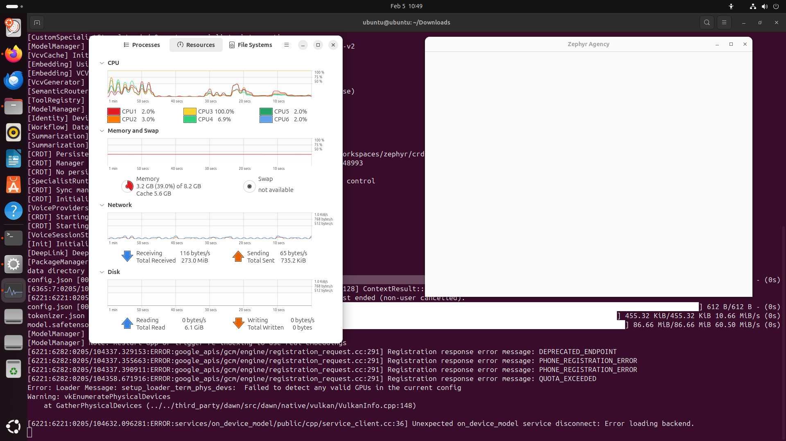

|                 |                          |
|-----------------|--------------------------|
| **Tester Name** | Robin van Boven          |
| **Role**        | Senior Engineer          |
| **Platform**    | Linux (amd64)            |
| **Date**        | Feb 5th, 2026 |

# Step 0: Installation

*Download, install, and first launch of Zephyr Agency Nightly*

|  |  |
|----|----|
| **Area** | Installation & First Launch |
| **Pre-condition** | Internet connection, download link from Quick Start guide |
| **Time** | 5–10 minutes |

**INST-01: Download**

**Pre-condition:** *Download link from Quick Start guide*

|  |  |  |  |
|:--:|:--:|:--:|:--:|
| **Step** | **Action** | **Expected** | **Result** |
| 1 | Click the download link for your platform from the Quick Start guide | Download starts in your browser | OK |
| 2 | Wait for download to complete | File downloaded: .dmg (macOS), .msi or .exe (Windows), .AppImage or .deb (Linux) | OK |
| 3 | Check the downloaded file size | File is not 0 bytes and appears complete | OK |

**Notes:**

|     |
|-----|
|     |

**INST-02: Install — macOS**

**Pre-condition:** *INST-01 complete, .dmg file downloaded. Skip if not on macOS.*

|  |  |  |  |
|:--:|:--:|:--:|:--:|
| **Step** | **Action** | **Expected** | **Result** |
| 1 | Double-click the .dmg file | Disk image mounts, Finder window opens |  |
| 2 | Drag Zephyr Agency Nightly to Applications folder | App copies to /Applications |  |
| 3 | Eject the disk image | Disk image unmounts cleanly |  |

**Notes:**

|     |
|-----|
|     |

**INST-03: Install — Windows**

**Pre-condition:** *INST-01 complete, installer downloaded. Skip if not on Windows.*

|  |  |  |  |
|:--:|:--:|:--:|:--:|
| **Step** | **Action** | **Expected** | **Result** |
| 1 | Run the downloaded installer (.msi or .exe) | Installer window appears |  |
| 2 | Follow the installation prompts | Installation completes without errors |  |
| 3 | Check Start Menu or Desktop for Zephyr Agency shortcut | Shortcut is present |  |

**Notes:**

|     |
|-----|
|     |

**INST-04: Install — Linux**

**Pre-condition:** *INST-01 complete, package downloaded. Skip if not on Linux.*

|  |  |  |  |
|:--:|:--:|:--:|:--:|
| **Step** | **Action** | **Expected** | **Result** |
| 1 | Install via your package manager (.deb) or make the .AppImage executable (chmod +x) | Installation completes or AppImage is executable | OK |
| 2 | Verify the app appears in your application launcher or can be run from terminal | App is launchable | FAIL |

**Notes:**

<table>
<colgroup>
<col style="width: 100%" />
</colgroup>
<tbody>
<tr>
<td>
Fails to launch with permission error. 
[6086:6086:0205/103951.950377:FATAL:sandbox/linux/services/credentials.cc:131] Check failed: . : Permission denied (13) 
 
This turns out is apparmor related. 
Using the following workaround:

sudo sysctl -w kernel.apparmor_restrict_unprivileged_userns=0 
 
The application starts, but remains a white screen. 
One of the CPU cores stays at 100%.

(Vulkan error here is related to VM use, did not happen on bare metal)
</td>
</tr>
</tbody>
</table>

**INST-05: First Launch**

**Pre-condition:** *Installation complete (INST-02, INST-03, or INST-04)*

|  |  |  |  |
|:--:|:--:|:--:|:--:|
| **Step** | **Action** | **Expected** | **Result** |
| 1 | Launch Zephyr Agency Nightly from your applications | App begins to load |  |
| 2 | If macOS Gatekeeper blocks the app: go to System Settings → Privacy & Security → click "Open Anyway" | Security prompt clears, app launches |  |
| 3 | Wait for the app window to appear | Main window visible within 10 seconds |  |
| 4 | Observe the window | Sidebar visible on the left with navigation items |  |
| 5 | Look for a Sign In option | "Sign In" button visible at bottom of sidebar |  |

**Notes:**

|     |
|-----|
|     |

**INST-06: Verify Installation**

**Pre-condition:** *App has launched successfully (INST-05)*

|  |  |  |  |
|:--:|:--:|:--:|:--:|
| **Step** | **Action** | **Expected** | **Result** |
| 1 | Check the app launched without crashing | Window appeared, no crash dialog |  |
| 2 | Observe the sidebar | Left panel with navigation items is visible |  |
| 3 | Check for error dialogs | No modal errors or warning dialogs on launch |  |
| 4 | Try resizing the window (drag corners or edges) | Window resizes smoothly |  |
| 5 | Try fullscreen (green button on macOS, F11 on Windows/Linux) | App enters and exits fullscreen cleanly |  |

**Notes:**

|     |
|-----|
|     |

**INST-07: Record Your Environment**

*Fill in the details below. This helps us reproduce any issues you find.*

|                         |                  |
|-------------------------|------------------|
| **App Version**         | 0.1.4-e2ddd7b    |
| **OS Version**          | Ubuntu 24.04 LTS |
| **Chip / Architecture** | x86_64           |
| **Network**             | WiFi 6           |

**Notes:**

<table>
<colgroup>
<col style="width: 100%" />
</colgroup>
<tbody>
<tr>
<td>CPU: i7-11800H 
GPU: RTX 3050 Mobile 
RAM: 32GB 
 
X11 display session</td>
</tr>
</tbody>
</table>

# Setup Guidance

*If you hit any of these issues during installation, try the workaround below before marking as Blocked.*

|  |  |
|----|----|
| **Issue** | **Workaround** |
| macOS Gatekeeper blocks the app | System Settings → Privacy & Security → Open Anyway |
| macOS "App is damaged" error | Open Terminal and run: xattr -cr "/Applications/Zephyr Agency Nightly.app" |
| Windows SmartScreen warning | Click "More info" → "Run anyway" |
| Linux AppImage won’t run | chmod +x ZephyrAgency.AppImage then run again |

# General Notes and Observations

*Record any overall impressions, patterns, or issues noticed during installation.*

|     |
|-----|
|     |

If all checks pass, proceed to **Step 1: Authentication**.

If the app fails to launch or crashes on start, record the issue in the General Notes above and report it in the Zulip QA channel before continuing.
