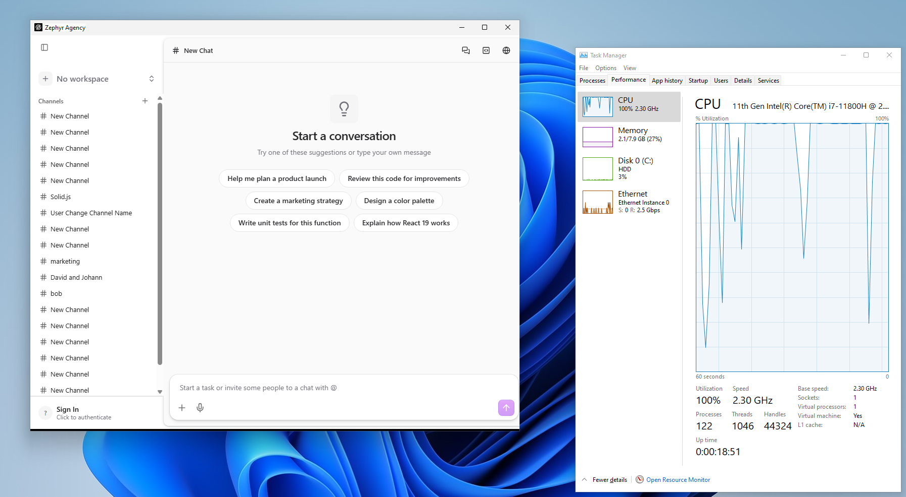
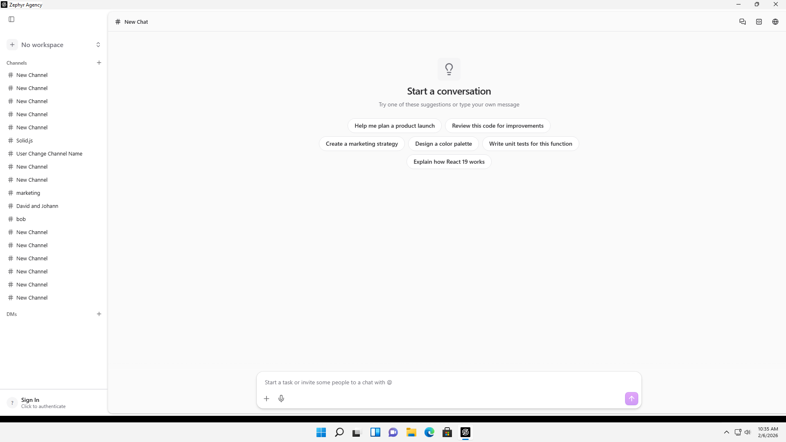
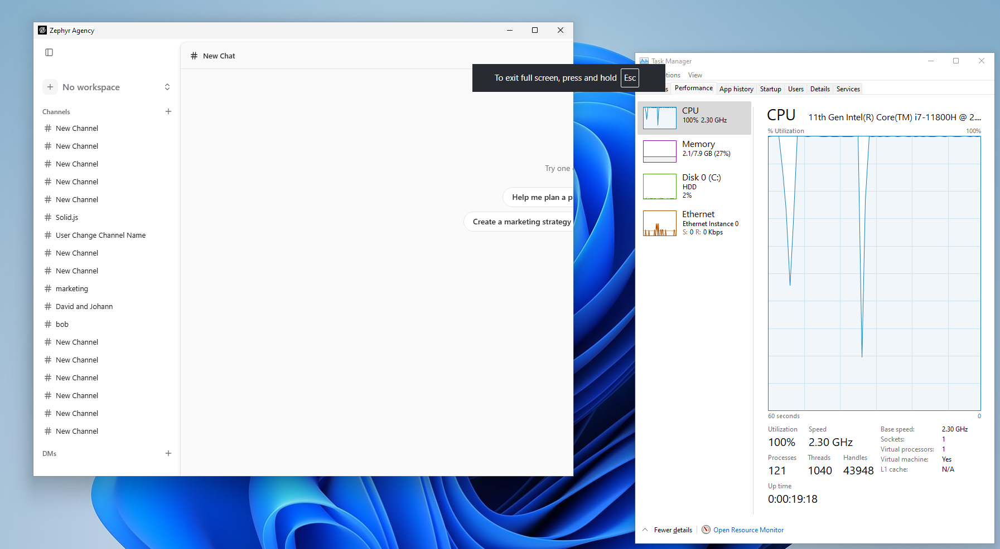

|                 |                          |
|-----------------|--------------------------|
| **Tester Name** | Robin van Boven          |
| **Role**        | Senior Engineer          |
| **Platform**    | Windows 11 (x86_64, VM)  |
| **Date**        | Feb 6th, 2026 |

# Step 0: Installation

*Download, install, and first launch of Zephyr Agency Nightly*

|  |  |
|----|----|
| **Area** | Installation & First Launch |
| **Pre-condition** | Internet connection, download link from Quick Start guide |
| **Time** | 5–10 minutes |

**INST-01: Download**

**Pre-condition:** *Download link from Quick Start guide*

|  |  |  |  |
|:--:|:--:|:--:|:--:|
| **Step** | **Action** | **Expected** | **Result** |
| 1 | Click the download link for your platform from the Quick Start guide | Download starts in your browser | OK |
| 2 | Wait for download to complete | File downloaded: .dmg (macOS), .msi or .exe (Windows), .AppImage or .deb (Linux) | OK |
| 3 | Check the downloaded file size | File is not 0 bytes and appears complete | OK |

**Notes:**

|     |
|-----|
|     |

**INST-02: Install — macOS**

**Pre-condition:** *INST-01 complete, .dmg file downloaded. Skip if not on macOS.*

|  |  |  |  |
|:--:|:--:|:--:|:--:|
| **Step** | **Action** | **Expected** | **Result** |
| 1 | Double-click the .dmg file | Disk image mounts, Finder window opens |  |
| 2 | Drag Zephyr Agency Nightly to Applications folder | App copies to /Applications |  |
| 3 | Eject the disk image | Disk image unmounts cleanly |  |

**Notes:**

|     |
|-----|
|     |

**INST-03: Install — Windows**

**Pre-condition:** *INST-01 complete, installer downloaded. Skip if not on Windows.*

|  |  |  |  |
|:--:|:--:|:--:|:--:|
| **Step** | **Action** | **Expected** | **Result** |
| 1 | Run the downloaded installer (.msi or .exe) | Installer window appears | OK |
| 2 | Follow the installation prompts | Installation completes without errors | OK |
| 3 | Check Start Menu or Desktop for Zephyr Agency shortcut | Shortcut is present | OK |

**Notes:**

|     |
|-----|
|     |

**INST-04: Install — Linux**

**Pre-condition:** *INST-01 complete, package downloaded. Skip if not on Linux.*

|  |  |  |  |
|:--:|:--:|:--:|:--:|
| **Step** | **Action** | **Expected** | **Result** |
| 1 | Install via your package manager (.deb) or make the .AppImage executable (chmod +x) | Installation completes or AppImage is executable |  |
| 2 | Verify the app appears in your application launcher or can be run from terminal | App is launchable |  |

**Notes:**

|     |
|-----|
|     |

**INST-05: First Launch**

**Pre-condition:** *Installation complete (INST-02, INST-03, or INST-04)*

|  |  |  |  |
|:--:|:--:|:--:|:--:|
| **Step** | **Action** | **Expected** | **Result** |
| 1 | Launch Zephyr Agency Nightly from your applications | App begins to load | OK |
| 2 | If macOS Gatekeeper blocks the app: go to System Settings → Privacy & Security → click "Open Anyway" | Security prompt clears, app launches | N/A |
| 3 | Wait for the app window to appear | Main window visible within 10 seconds | OK |
| 4 | Observe the window | Sidebar visible on the left with navigation items | OK |
| 5 | Look for a Sign In option | "Sign In" button visible at bottom of sidebar | OK |

**Notes:**

<table>
<colgroup>
<col style="width: 100%" />
</colgroup>
<tbody>
<tr>
<td>
A black bar at the bottom of the window, which seems to not belong there. 
This occurs at particular window sizes, when resizing.

<em>Odd black bar on the bottom of the window.</em>

<em>Especially notable when maximized.</em>
</td>
</tr>
</tbody>
</table>

**INST-06: Verify Installation**

**Pre-condition:** *App has launched successfully (INST-05)*

|  |  |  |  |
|:--:|:--:|:--:|:--:|
| **Step** | **Action** | **Expected** | **Result** |
| 1 | Check the app launched without crashing | Window appeared, no crash dialog | OK |
| 2 | Observe the sidebar | Left panel with navigation items is visible | OK |
| 3 | Check for error dialogs | No modal errors or warning dialogs on launch | OK |
| 4 | Try resizing the window (drag corners or edges) | Window resizes smoothly | OK |
| 5 | Try fullscreen (green button on macOS, F11 on Windows/Linux) | App enters and exits fullscreen cleanly | FAIL |

**Notes:**

<table>
<colgroup>
<col style="width: 100%" />
</colgroup>
<tbody>
<tr>
<td>
Resizing performance degraded because it’s a VM. Similar to any other app, like File Explorer.

Full screen is bugged, it changes the app layout, but stays within the bounds of the existing window. Returning from full screen gives black areas, until the window is resized.

<em>Full screen breaking the layout, staying within the window.</em>
</td>
</tr>
</tbody>
</table>

**INST-07: Record Your Environment**

*Fill in the details below. This helps us reproduce any issues you find.*

|                         |                              |
|-------------------------|------------------------------|
| **App Version**         | 0.1.4 nightly                |
| **OS Version**          | Windows 11 21H2              |
| **Chip / Architecture** | x86_64                       |
| **Network**             | WiFi 6 (VM virtual ethernet) |

**Notes:**

<table>
<colgroup>
<col style="width: 100%" />
</colgroup>
<tbody>
<tr>
<td>Virtual Machine, 8 vCPU, 8100MB RAM. 
 
Specific build used 
https://cdn.crabnebula.app/asset/01KGS0K40C4Z54KHSXBEFGAEV8</td>
</tr>
</tbody>
</table>

# Setup Guidance

*If you hit any of these issues during installation, try the workaround below before marking as Blocked.*

|  |  |
|----|----|
| **Issue** | **Workaround** |
| macOS Gatekeeper blocks the app | System Settings → Privacy & Security → Open Anyway |
| macOS "App is damaged" error | Open Terminal and run: xattr -cr "/Applications/Zephyr Agency Nightly.app" |
| Windows SmartScreen warning | Click "More info" → "Run anyway" |
| Linux AppImage won’t run | chmod +x ZephyrAgency.AppImage then run again |

# General Notes and Observations

*Record any overall impressions, patterns, or issues noticed during installation.*

<table>
<colgroup>
<col style="width: 100%" />
</colgroup>
<tbody>
<tr>
<td>100% CPU usage. 
 
Closing the app requires pressing the X twice. 
Once turns the app to a black screen. Second time actually closing. 
 
Window focus seems to behave incorrectly. When using Alt+TAB to move focus to Zephyr Agency, keybinds such as Alt+F4 and F11 don’t work. After clicking the UI, this functionality is restored and keybinds work as expected.</td>
</tr>
</tbody>
</table>

If all checks pass, proceed to **Step 1: Authentication**.

If the app fails to launch or crashes on start, record the issue in the General Notes above and report it in the Zulip QA channel before continuing.
