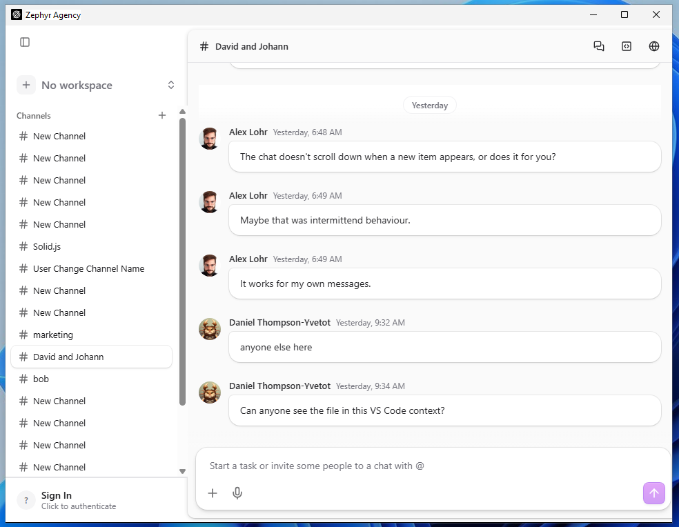
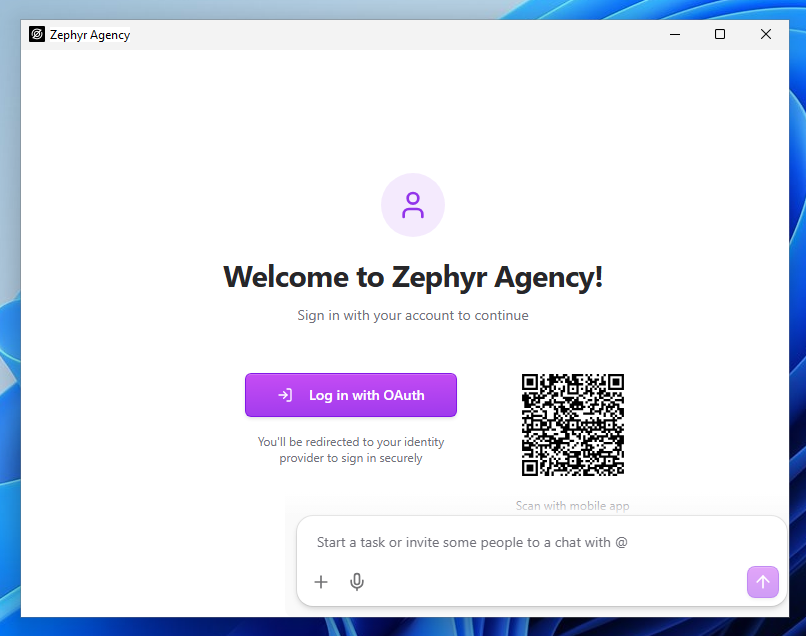
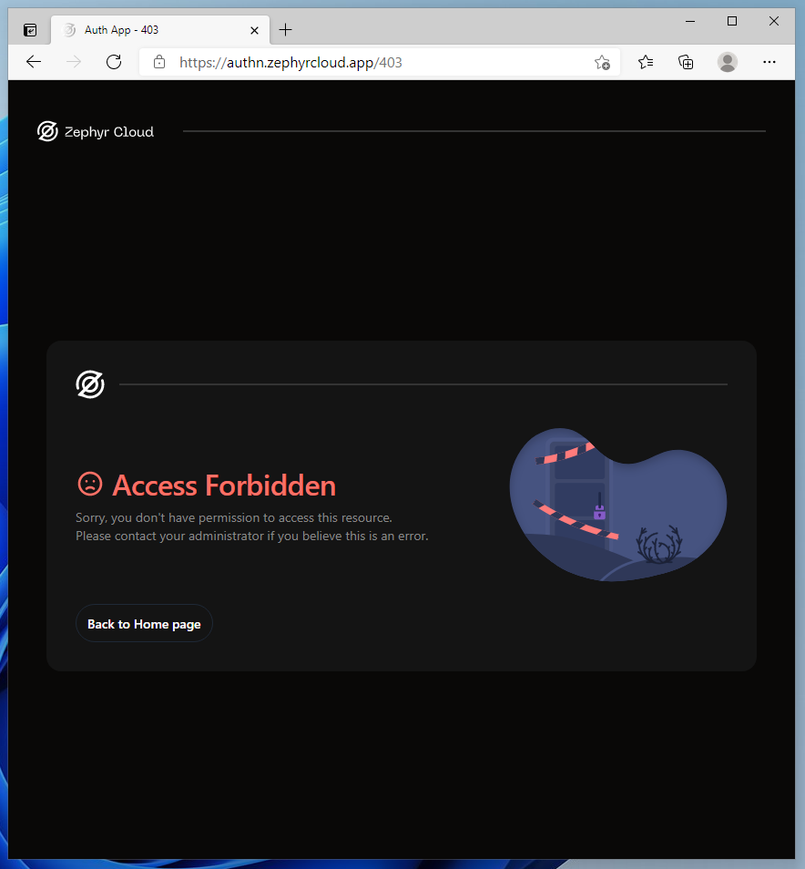
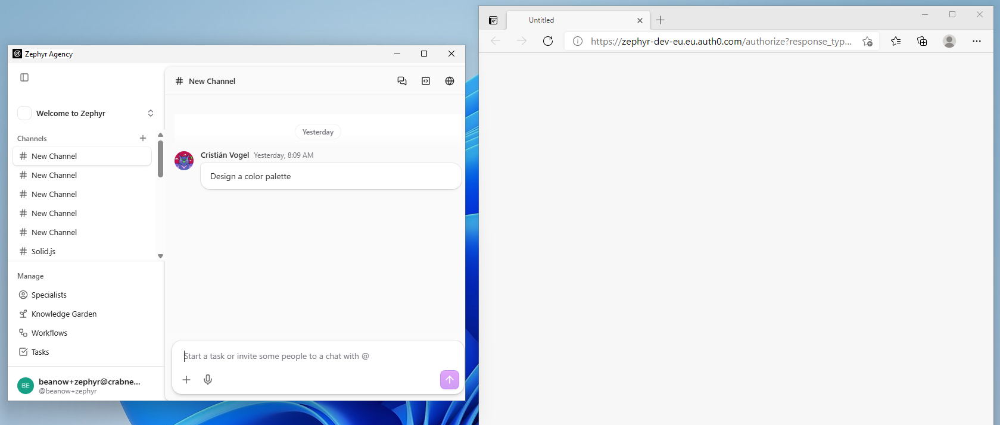
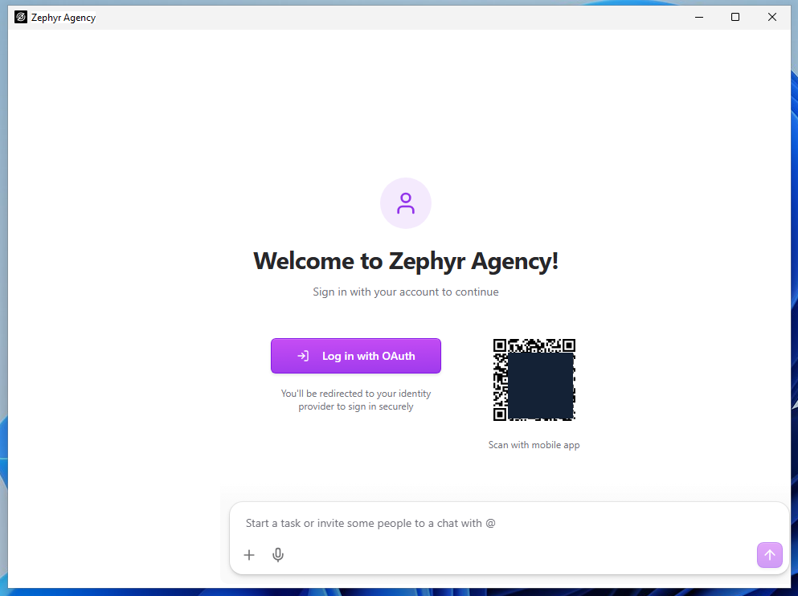
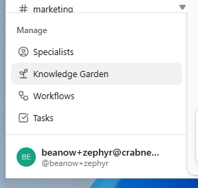
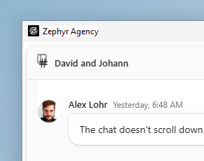
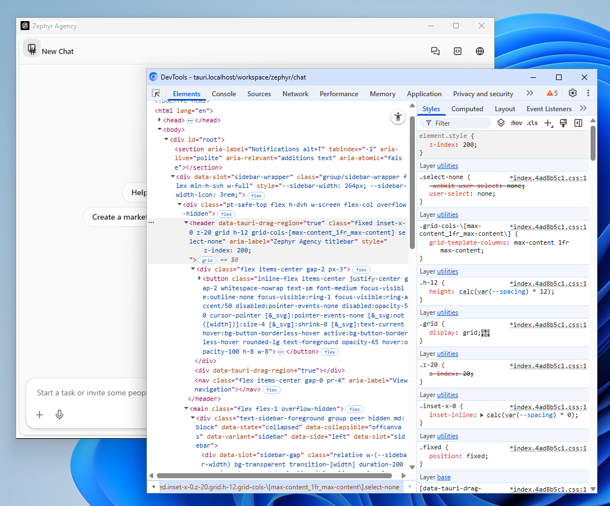

|                 |                          |
|-----------------|--------------------------|
| **Tester Name** | Robin van Boven          |
| **Role**        | Senior Engineer          |
| **Platform**    | Windows 11               |
| **Date**        | Feb 6th, 2026 |

# Step 1: Authentication

*Sign-in flows, OAuth providers, session management*

|                   |                                  |
|-------------------|----------------------------------|
| **Area**          | Sign-in flows (external browser) |
| **Pre-condition** | Unauthenticated (signed out)     |

**AUTH-11: Unauthenticated Navigation**

**Pre-condition:** *Unauthenticated, app just launched*

|  |  |  |  |
|:--:|:--:|:--:|:--:|
| **Step** | **Action** | **Expected** | **Result** |
| 1 | Observe sidebar | Channels visible but content not accessible | FAIL |
| 2 | Observe Manage section | Specialists, Knowledge, Workflows, Tasks — not accessible | OK |
| 3 | Try to navigate | Content protected, requires sign-in |  |

**Notes:**

<table>
<colgroup>
<col style="width: 100%" />
</colgroup>
<tbody>
<tr>
<td>
Channel content is visible before authentication.

</td>
</tr>
</tbody>
</table>

**AUTH-01: Sign In Button Location**

**Pre-condition:** *Unauthenticated, app open*

|  |  |  |  |
|:--:|:--:|:--:|:--:|
| **Step** | **Action** | **Expected** | **Result** |
| 1 | Observe sidebar bottom | "Sign In" button visible | OK |
| 2 | Observe button text | "Sign In" with "Click to authenticate" subtext | OK |

**Notes:**

|     |
|-----|
|     |

**AUTH-02: Sign In Page (Auth0)**

**Pre-condition:** *Unauthenticated*

|  |  |  |  |
|:--:|:--:|:--:|:--:|
| **Step** | **Action** | **Expected** | **Result** |
| 1 | Click "Sign In" button in sidebar | Browser opens to Auth0 login page | FAIL |
| 2 | Observe URL | zephyr-dev-eu.eu.auth0.com/... | OK |
| 3 | Observe heading | "Welcome" | OK |
| 4 | Observe subheading | "Log in to zephyr-dev-eu to continue to Zephyr Agency Tauri" | OK |
| 5 | Observe email input | Email address field with Continue button | OK |
| 6 | Observe "Sign up" link | "Don't have an account? Sign up" | OK |
| 7 | Observe OAuth providers | 4 buttons: Google, GitHub, Microsoft, Zephyr Okta Dev | OK |

**Notes:**

|  |
|----|
| Probably intended, but clicking “Sign in” does not directly go to browser. Instead showing these options. Note it’s offset by where the sidebar would have been. Next steps are after using the “Log in with OAuth button”. |

**AUTH-03: Google OAuth Flow**

**Pre-condition:** *On Auth0 login page*

|  |  |  |  |
|:--:|:--:|:--:|:--:|
| **Step** | **Action** | **Expected** | **Result** |
| 1 | Click "Continue with Google" | Google sign-in page loads | B |
| 2 | Select/enter Google account | Google authenticates | B |
| 3 | Complete authentication | Redirects back to app | B |
| 4 | Observe app state | User authenticated, avatar visible in sidebar | B |
| 5 | Observe browser window | Auth0 window stays open (must manually close) | B |

**Notes:**

<table>
<colgroup>
<col style="width: 100%" />
</colgroup>
<tbody>
<tr>
<td>
Using email &amp; password approach. 
 
Initial signup sent a confirmation code to spam folder. Choosing a password has a policy incompatible with 1password default generator (requiring special characters). With a password set, redirected to a 403 page. Sending an email confirmation email in the background.

<em>Had to</em> restart the authentication flow from the Zephyr Agency app. It leaves the browser window open after the code is passed back to the app.

</td>
</tr>
</tbody>
</table>

**AUTH-04: GitHub OAuth Flow**

**Pre-condition:** *Sign-in modal open*

|  |  |  |  |
|:--:|:--:|:--:|:--:|
| **Step** | **Action** | **Expected** | **Result** |
| 1 | Click "Log in with OAuth" button | OAuth page opens | B |
| 2 | Select GitHub option | GitHub auth page loads | B |
| 3 | Observe result | Error: "redirect_uri is not associated with this application" | B |

**Notes:**

|                                                     |
|-----------------------------------------------------|
| Using email & password approach. See previous step. |

**AUTH-05: QR Code Display**

**Pre-condition:** *Sign-in modal open*

|  |  |  |  |
|:--:|:--:|:--:|:--:|
| **Step** | **Action** | **Expected** | **Result** |
| 1 | Observe QR code area | QR code image visible | OK |
| 2 | Observe QR code label | "Scan with mobile app" | OK |
| 3 | QR code appears valid | Black/white square pattern, not broken | OK |

**Notes:**

<table>
<colgroup>
<col style="width: 100%" />
</colgroup>
<tbody>
<tr>
<td>
A little small and blurry. But my phone scanned it. Contains a format like 
 
zephyr://qr-auth?code=...&amp;ip=...&amp;country=NL 
 
Note this plain text IP address may have GDPR implications. Especially if leaked through over-the-shoulder watching or streaming / screen sharing.

 
<em>MASKED the QR code for my own privacy here.</em>
</td>
</tr>
</tbody>
</table>

**AUTH-06: Close Sign In Modal**

**Pre-condition:** *Sign-in modal open*

|          |                              |                       |            |
|:--------:|:----------------------------:|:---------------------:|:----------:|
| **Step** |          **Action**          |     **Expected**      | **Result** |
|    1     |     Click "Close" button     |     Modal closes      |     OK     |
|    2     |      Observe app state       | Still unauthenticated |     OK     |
|    3     | Sign In button still visible |   Can reopen modal    |     OK     |

**Notes:**

|     |
|-----|
|     |

**AUTH-07: Close Sign In Modal — Escape**

**Pre-condition:** *Sign-in modal open*

|          |                   |                       |            |
|:--------:|:-----------------:|:---------------------:|:----------:|
| **Step** |    **Action**     |     **Expected**      | **Result** |
|    1     | Press Escape key  |     Modal closes      |     OK     |
|    2     | Observe app state | Still unauthenticated |     OK     |

**Notes:**

<table>
<colgroup>
<col style="width: 100%" />
</colgroup>
<tbody>
<tr>
<td>Note: ESC only works when focus is correctly captured by clicking the UI. 
Alt+TAB to another app, then back to Zephyr Agency, the ESC keybind does not work. 
 
Click on a blank area of the app, then ESC works again.</td>
</tr>
</tbody>
</table>

**AUTH-08: Authenticated State**

**Pre-condition:** *Successfully authenticated*

|  |  |  |  |
|:--:|:--:|:--:|:--:|
| **Step** | **Action** | **Expected** | **Result** |
| 1 | Observe sidebar bottom | User avatar visible | OK |
| 2 | Observe user name | Display name shown | OK |
| 3 | Observe username | @handle shown | OK |
| 4 | Sign In button | No longer visible | OK |
| 5 | Observe previous data | Check if channels, settings persist from before sign-out | OK |

**Notes:**

|  |
|----|
| Assuming my email is considered the display name. |

**AUTH-09: User Menu (Authenticated)**

**Pre-condition:** *Authenticated*

|  |  |  |  |
|:--:|:--:|:--:|:--:|
| **Step** | **Action** | **Expected** | **Result** |
| 1 | Click user avatar/name area | User menu opens | OK |
| 2 | Observe menu options | "Settings" and "Sign out" visible | OK |

**Notes:**

|     |
|-----|
|     |

**AUTH-10: Sign Out**

**Pre-condition:** *Authenticated, user menu open*

|  |  |  |  |
|:--:|:--:|:--:|:--:|
| **Step** | **Action** | **Expected** | **Result** |
| 1 | Click "Sign out" in user menu | Sign out process starts | OK |
| 2 | Observe app state | User signed out | OK |
| 3 | Observe sidebar | "Sign In" button visible again | OK |
| 4 | User avatar | No longer visible | OK |

**Notes:**

|     |
|-----|
|     |

# General Notes and Observations

*Record any overall impressions, patterns, or issues noticed during testing.*

<table>
<colgroup>
<col style="width: 100%" />
</colgroup>
<tbody>
<tr>
<td>
Cannot expand the sidebar once it’s hidden. Obscured by the title.

Required using DevTools to change this button’s z-index.
</td>
</tr>
</tbody>
</table>
