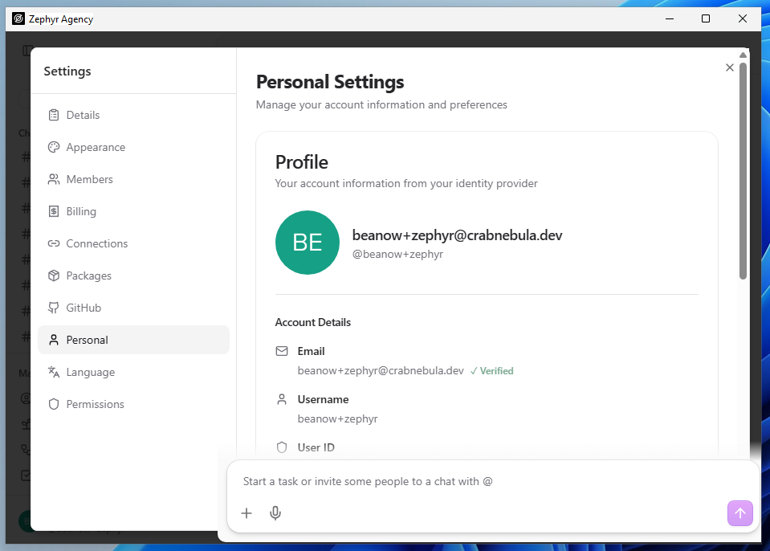
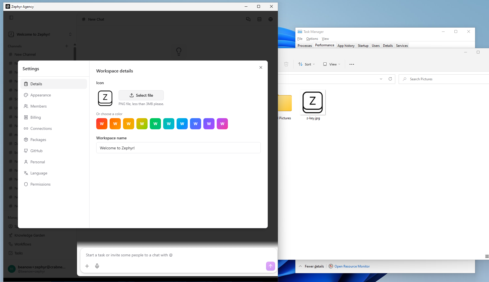
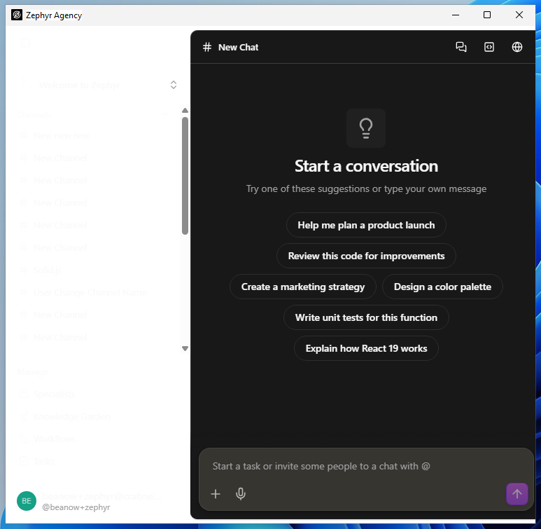
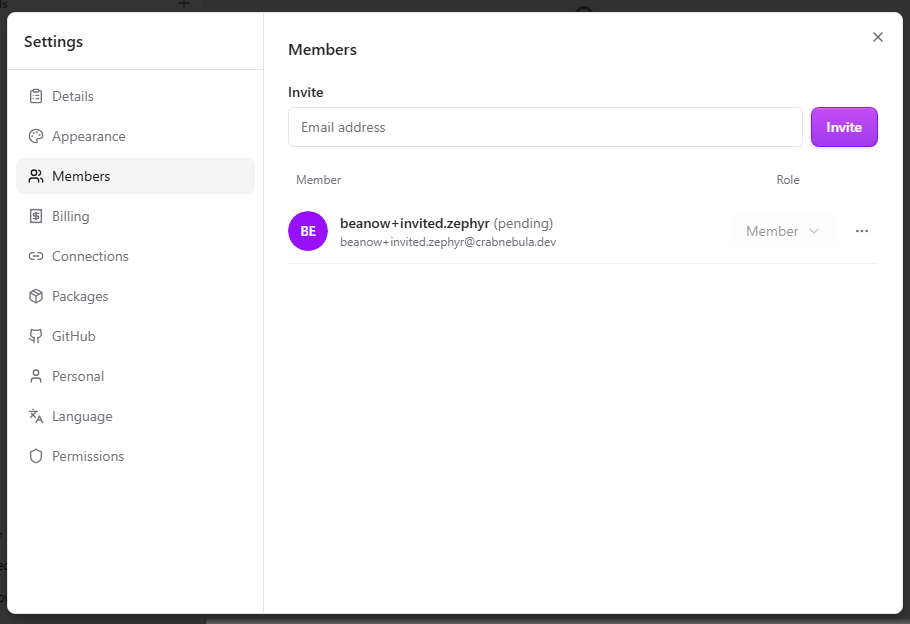
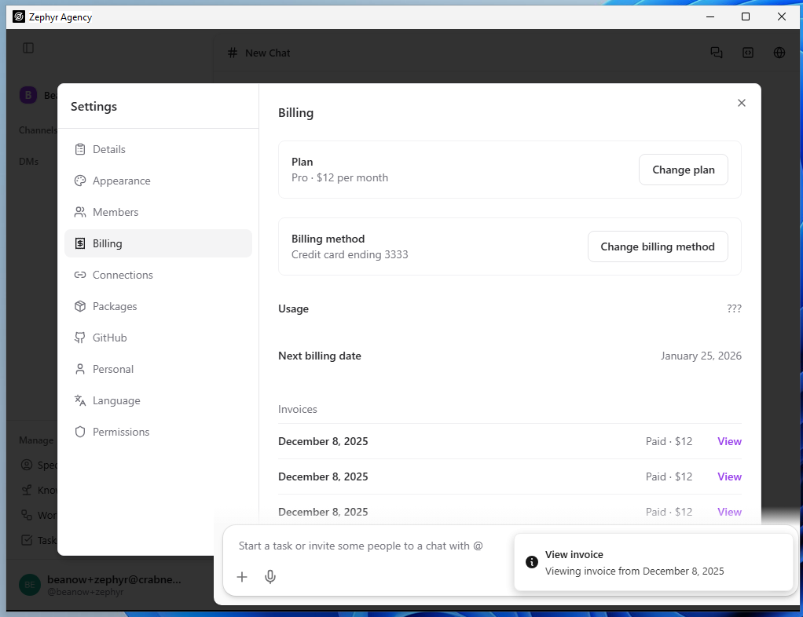
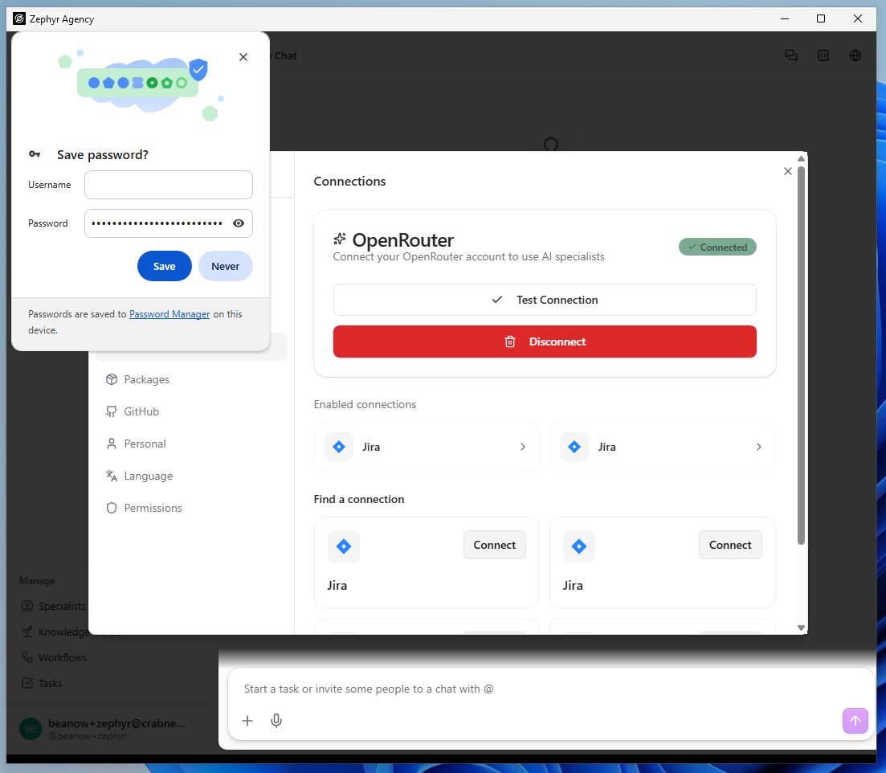
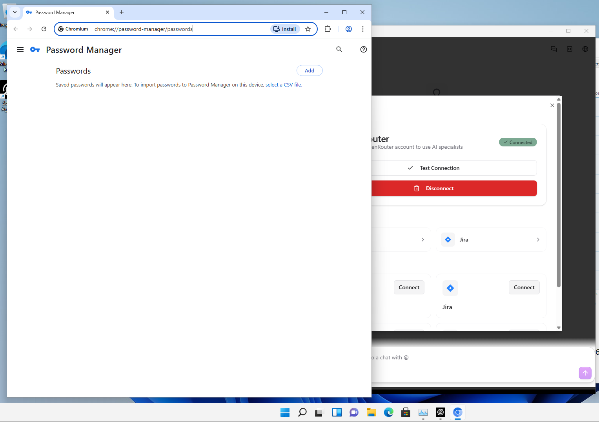

|                 |                 |
|-----------------|-----------------|
| **Tester Name** | Robin van Boven |
| **Role**        | Senior Engineer |
| **Platform**    | Windows 11      |
| **Date**        | Feb 6th, 2026   |

# Step 2: Settings

*Settings modal, API key configuration, workspace preferences*

|                   |                                |
|-------------------|--------------------------------|
| **Area**          | Settings Modal (via user menu) |
| **Pre-condition** | Authenticated                  |

**SET-01: Open Settings**

**Pre-condition:** *Authenticated, on any page*

|  |  |  |  |
|:--:|:--:|:--:|:--:|
| **Step** | **Action** | **Expected** | **Result** |
| 1 | Locate user menu button in sidebar | User avatar/name at bottom of sidebar | OK |
| 2 | Click user menu button | Menu opens | OK |
| 3 | Click "Settings" in menu | Settings modal opens | OK |
| 4 | Observe modal | Settings panel with sections visible | OK |

**Notes:**

<table>
<colgroup>
<col style="width: 100%" />
</colgroup>
<tbody>
<tr>
<td>
Chat input overlaps the modal.

</td>
</tr>
</tbody>
</table>

**SET-02: Settings Sections**

**Pre-condition:** *Settings modal open*

|  |  |  |  |
|:--:|:--:|:--:|:--:|
| **Step** | **Action** | **Expected** | **Result** |
| 1 | Observe left navigation | List of sections visible | OK |
| 2 | Count sections | 9 sections | FAIL |
| 3 | Read section names | Details, Appearance, Members, Billing, Connections, Packages, GitHub, Personal, Permissions | FAIL |

**Notes:**

|                        |
|------------------------|
| Also includes Language |

**SET-03: Details Section**

**Pre-condition:** *Settings modal open*

|  |  |  |  |
|:--:|:--:|:--:|:--:|
| **Step** | **Action** | **Expected** | **Result** |
| 1 | Click "Details" in settings nav | Details section loads | OK |
| 2 | Observe workspace icon | Icon with "Select file" option | OK |
| 3 | Observe workspace name | Editable text field | OK |
| 4 | Observe theme selector | Color theme options for icon | OK |

**Notes:**

<table>
<colgroup>
<col style="width: 100%" />
</colgroup>
<tbody>
<tr>
<td>
Clicking “Select file” freezes the app for 10-60 seconds. 
 
File extension filter can be disabled, and uploading a JPG works. In spite of the subtext saying PNG only.

</td>
</tr>
</tbody>
</table>

**SET-04: Appearance Section**

**Pre-condition:** *Settings modal open*

|  |  |  |  |
|:--:|:--:|:--:|:--:|
| **Step** | **Action** | **Expected** | **Result** |
| 1 | Click "Appearance" in settings nav | Appearance section loads | OK |
| 2 | Observe options | Theme or display options visible | OK |
| 3 | Note current theme state | Record: Light/Dark/System | System |
| 4 | If theme toggle exists, toggle it | UI updates accordingly | FAIL |
| 5 | Close Settings modal | Modal closes | OK |
| 6 | Reload app (Cmd+R) | App reloads | OK |
| 7 | Re-open Settings → Appearance | Check theme state | OK |
| 8 | Verify theme persisted | Theme matches what was set in step 4 | OK |

**Notes:**

<table>
<colgroup>
<col style="width: 100%" />
</colgroup>
<tbody>
<tr>
<td>Note: using Ctrl+R as we don’t have Cmd on Windows. 
 
Dark theme does not properly apply. Particularly the sidebar becomes white-on-white and hard to use.</td>
</tr>
</tbody>
</table>

**SET-05: Members Section**

**Pre-condition:** *Settings modal open*

|  |  |  |  |
|:--:|:--:|:--:|:--:|
| **Step** | **Action** | **Expected** | **Result** |
| 1 | Click "Members" in settings nav | Members section loads | OK |
| 2 | Observe Invite section | Email input field with "Invite" button | OK |
| 3 | Observe member list | Member/Role columns | OK |
| 4 | Observe empty state | "No members found. Invite someone to get started." | OK |

**Notes:**

<table>
<colgroup>
<col style="width: 100%" />
</colgroup>
<tbody>
<tr>
<td>Every workspace includes “239 members” and an enterprise plan, according to the workspace selector. This doesn’t match the members page. 
</td>
</tr>
</tbody>
</table>

**SET-06: Billing Section**

**Pre-condition:** *Settings modal open*

|  |  |  |  |
|:--:|:--:|:--:|:--:|
| **Step** | **Action** | **Expected** | **Result** |
| 1 | Click "Billing" in settings nav | Billing section loads | OK |
| 2 | Observe Plan | Shows plan name and price | OK |
| 3 | Observe "Change plan" button | Button opens plan options | FAIL |
| 4 | Observe Billing method | Shows payment method | FAIL |
| 5 | Observe Usage | Usage information displayed | FAIL |
| 6 | Observe Next billing date | Shows date | FAIL |
| 7 | Observe Invoices | List of past invoices with View links | FAIL |

**Notes:**

<table>
<colgroup>
<col style="width: 100%" />
</colgroup>
<tbody>
<tr>
<td>
FAILs because all information is mocked. Clicking view on invoices shows a toast, but no invoice.

</td>
</tr>
</tbody>
</table>

**SET-07: Connections Section (API Keys)**

**Pre-condition:** *Settings modal open*

|  |  |  |  |
|:--:|:--:|:--:|:--:|
| **Step** | **Action** | **Expected** | **Result** |
| 1 | Click "Connections" in settings nav | Connections section loads | OK |
| 2 | Observe OpenRouter section | "Sign in with OpenRouter" button OR "Use API Key Instead" | OK |
| 3 | Click "Use API Key Instead" | API key input field appears | OK |
| 4 | Enter the API key provided in the Quick Start guide | Key accepted, connection status updates | OK |
| 5 | Observe connection status | Connection status badge shown |  |
| 6 | Observe "Enabled connections" | List of active integrations |  |
| 7 | Observe "Find a connection" | Available integrations with "Connect" buttons |  |

***Note: The API key provided on the Quick Start guide should be entered here under OpenRouter. This enables the AI features tested in later steps.***

**Notes:**

<table>
<colgroup>
<col style="width: 100%" />
</colgroup>
<tbody>
<tr>
<td>
“Password manager” offers to save the API key.

Clicking the Password Manager link on this prompt, opens up Chromium at URL chrome://password-manager/passwords

</td>
</tr>
</tbody>
</table>

**SET-08: Packages Section**

**Pre-condition:** *Settings modal open*

|  |  |  |  |
|:--:|:--:|:--:|:--:|
| **Step** | **Action** | **Expected** | **Result** |
| 1 | Click "Packages" in settings nav | Package Manager loads | OK |
| 2 | Observe tabs | "Browse" and "Installed" tabs | OK |
| 3 | Click "Browse" tab | Browse view loads | FAIL |
| 4 | Click "Installed" tab | Shows installed packages or empty state | OK |
| 5 | Observe empty state | "No packages installed" with "Browse Packages" button | OK |

**Notes:**

|                                                                |
|----------------------------------------------------------------|
| Browse tab says “Registry Unavailable” and returns no results. |

**SET-09: GitHub Section**

**Pre-condition:** *Settings modal open*

|  |  |  |  |
|:--:|:--:|:--:|:--:|
| **Step** | **Action** | **Expected** | **Result** |
| 1 | Click "GitHub" in settings nav | GitHub Integration section loads | OK |
| 2 | Observe heading | "Configure your personal access token for code review features" | FAIL |
| 3 | Observe token field | Input with placeholder "ghp_xxxxxxxxxxxxxxxxxxxx" | OK |
| 4 | Observe security note | "Token is stored securely in your system keychain" | OK |
| 5 | Observe instructions | Link to "GitHub Token Settings", required scopes: repo, read:org | FAIL |
| 6 | Try saving a test token | Click "Save Token" button, observe result | BLOCK |

**Notes:**

<table>
<colgroup>
<col style="width: 100%" />
</colgroup>
<tbody>
<tr>
<td>
Actual subtext “Configure your GitHub personal access token for code review features”.

Clicking the “GitHub Token Settings” link does not respond. 
The console shows error: Uncaught (in promise) Command plugin:shell|open not allowed by ACL 
 
 
Block = don’t have a test token to safely use.
</td>
</tr>
</tbody>
</table>

**SET-10: Personal Section**

**Pre-condition:** *Settings modal open*

|  |  |  |  |
|:--:|:--:|:--:|:--:|
| **Step** | **Action** | **Expected** | **Result** |
| 1 | Click "Personal" in settings nav | Personal Settings section loads | OK |
| 2 | Observe Profile section | Avatar, display name, username | OK |
| 3 | Observe Account Details | Email (with ✓ Verified), Username, User ID | OK |
| 4 | Observe User ID format | Shows OAuth provider ID (e.g., "google-oauth2\|...") | OK |
| 5 | Scroll down in modal | Logout button visible at bottom | OK |

**Notes:**

|                                             |
|---------------------------------------------|
| Note: assuming my email is the display name |

**SET-11: Permissions Section**

**Pre-condition:** *Settings modal open*

|  |  |  |  |
|:--:|:--:|:--:|:--:|
| **Step** | **Action** | **Expected** | **Result** |
| 1 | Click "Permissions" in settings nav | Permissions section loads | OK |
| 2 | Observe active sessions | List of sessions with permissions, or empty state | OK |
| 3 | Observe empty state | "No active sessions" or similar | OK |

**Notes:**

|                                       |
|---------------------------------------|
| “No active sessions with permissions” |

**SET-12: Close Settings**

**Pre-condition:** *Settings modal open*

|          |                     |                          |            |
|:--------:|:-------------------:|:------------------------:|:----------:|
| **Step** |     **Action**      |       **Expected**       | **Result** |
|    1     | Locate close button | X button in modal header |     OK     |
|    2     | Click close button  |       Modal closes       |     OK     |
|    3     |    Observe page     | Returns to previous view |     OK     |

**Notes:**

|     |
|-----|
|     |

**SET-13: Close Settings — Escape Key**

**Pre-condition:** *Settings modal open*

|          |                  |                          |            |
|:--------:|:----------------:|:------------------------:|:----------:|
| **Step** |    **Action**    |       **Expected**       | **Result** |
|    1     | Press Escape key |       Modal closes       |     OK     |
|    2     |   Observe page   | Returns to previous view |     OK     |

**Notes:**

|                                                 |
|-------------------------------------------------|
| Suffers from the focus issue like all keybinds. |

# General Notes and Observations

*Record any overall impressions, patterns, or issues noticed during testing.*

|     |
|-----|
|     |
