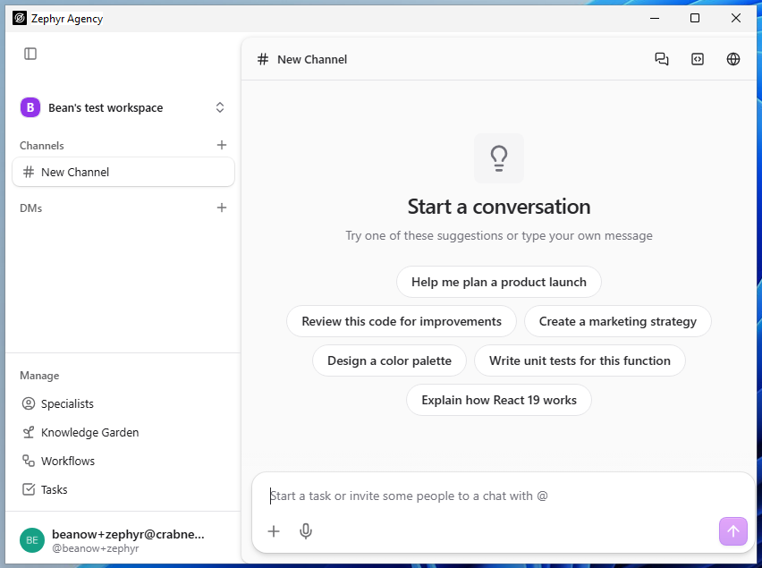
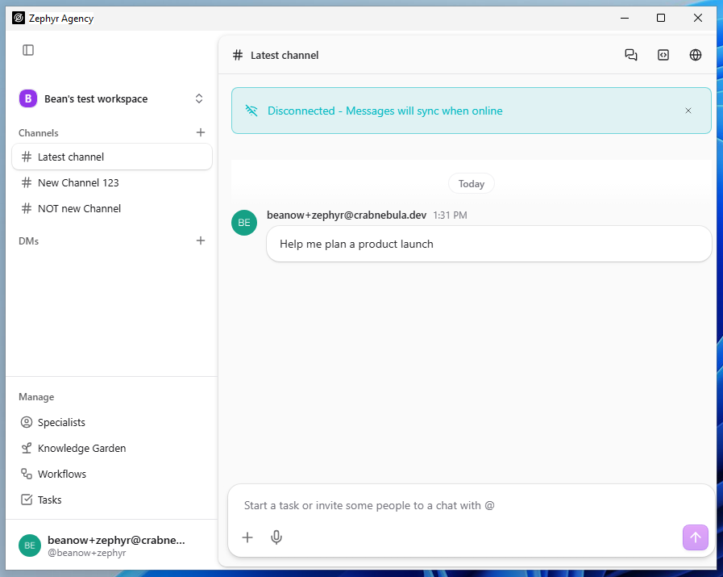
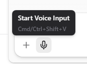

|                 |                 |
|-----------------|-----------------|
| **Tester Name** | Robin van Boven |
| **Role**        | Senior Engineer |
| **Platform**    | Windows 11      |
| **Date**        | Feb 6th, 2026   |

# Step 3: Chat

*Chat interface, channels, messaging, AI responses*

***Terminology: The UI calls conversations "Channels", not "Chats". The "+" button next to Channels creates a new Channel.***

|  |  |
|----|----|
| **Area** | /chat |
| **Pre-condition** | Authenticated, API key configured (Step 2: Settings → Connections) |

**CHAT-01: Page Load**

**Pre-condition:** *Authenticated, on any page*

|  |  |  |  |
|:--:|:--:|:--:|:--:|
| **Step** | **Action** | **Expected** | **Result** |
| 1 | Click "+" next to Channels in sidebar (or navigate to /chat) | New channel created, URL shows /chat | OK |
| 2 | Observe page title | Shows "New Chat" with \# icon | FAIL |
| 3 | Observe main content area | Shows "Start a conversation" heading | OK |
| 4 | Observe suggestion prompts | 6 prompt buttons visible | OK |

**Notes:**

|                                |
|--------------------------------|
| “New Channel” instead of Chat. |

**CHAT-02: Suggestion Prompts Display**

**Pre-condition:** *On /chat, no conversation started*

|  |  |  |  |
|:--:|:--:|:--:|:--:|
| **Step** | **Action** | **Expected** | **Result** |
| 1 | Count visible suggestion prompt buttons | 6 buttons visible | OK |
| 2 | Read first prompt | "Help me plan a product launch" | OK |
| 3 | Read second prompt | "Review this code for improvements" | OK |
| 4 | Read third prompt | "Create a marketing strategy" | OK |
| 5 | Read fourth prompt | "Design a color palette" | OK |
| 6 | Read fifth prompt | "Write unit tests for this function" | OK |
| 7 | Read sixth prompt | "Explain how React 19 works" | OK |

**Notes:**

|     |
|-----|
|     |

**CHAT-03: Message Input**

**Pre-condition:** *On /chat*

|  |  |  |  |
|:--:|:--:|:--:|:--:|
| **Step** | **Action** | **Expected** | **Result** |
| 1 | Locate message input area | Textarea with placeholder "Type a message..." visible | FAIL |
| 2 | Click into textarea | Cursor appears, textarea focused | OK |
| 3 | Type "Hello" | Text appears in textarea | OK |
| 4 | Observe send button | Purple/colored send button visible (arrow icon) | OK |
| 5 | Clear text (select all, delete) | Textarea empty | OK\* |

**Notes:**

<table>
<colgroup>
<col style="width: 100%" />
</colgroup>
<tbody>
<tr>
<td>“Start a task or invite some people to chat with @” as placeholder 
After clearing all text, the textarea shows the placeholder, rather than being empty. 
 
The send button is an UP arrow. This icon means “return to top” to me, not “send”.</td>
</tr>
</tbody>
</table>

**CHAT-04: Model Selector**

**Pre-condition:** *On /chat*

|  |  |  |  |
|:--:|:--:|:--:|:--:|
| **Step** | **Action** | **Expected** | **Result** |
| 1 | Locate model selector button | Button showing model name with icon | FAIL |
| 2 | Click model selector button | Dropdown or modal opens with model options | FAIL |
| 3 | Observe available models | List of AI models shown | FAIL |
| 4 | Press Escape or click outside | Selector closes | BLOCK |

**Notes:**

|                                        |
|----------------------------------------|
| There’s no model selector I could see. |

**CHAT-05: File Attachment**

**Pre-condition:** *On /chat*

|  |  |  |  |
|:--:|:--:|:--:|:--:|
| **Step** | **Action** | **Expected** | **Result** |
| 1 | Locate attachment button | Paperclip icon button near message input | FAIL |
| 2 | Click attachment button | File picker popup/dialog opens | FAIL |
| 3 | Cancel file picker | Dialog closes, no file attached | BLOCK |
| 4 | Verify popup dismissed | Attachment popup should not cover chat area | BLOCK |

**Notes:**

|                                               |
|-----------------------------------------------|
| Icon is a PLUS. Clicking it does not respond. |

**CHAT-06: Send Message**

**Pre-condition:** *On /chat, authenticated with working API connection*

|  |  |  |  |
|:--:|:--:|:--:|:--:|
| **Step** | **Action** | **Expected** | **Result** |
| 1 | Type "Hello, this is a test message" in message input | Text visible in input | OK |
| 2 | Click send button (purple arrow) | Message appears in chat area | FAIL |
| 3 | Observe response area | AI response begins generating (loading indicator or text appearing) | FAIL |
| 4 | Wait for completion (max 30 seconds) | Response completes with visible text content | FAIL |
| 5 | Verify response is not empty | Response contains actual text, not just whitespace or loading spinner | FAIL |

**Notes:**

<table>
<colgroup>
<col style="width: 100%" />
</colgroup>
<tbody>
<tr>
<td>First time sending any message (clicking the arrow), nothing happened. 
My own message did not appear, no AI response. 
 
Subsequent attempt, only my message appears. No reply, no loading indicators.</td>
</tr>
</tbody>
</table>

**CHAT-07: Suggestion Prompt Click**

**Pre-condition:** *On /chat, no conversation started*

|  |  |  |  |
|:--:|:--:|:--:|:--:|
| **Step** | **Action** | **Expected** | **Result** |
| 1 | Click "Help me plan a product launch" button | Text populates message input OR message sends immediately | OK |
| 2 | Observe behavior | Either input populated or conversation started | OK |

**Notes:**

|                                                        |
|--------------------------------------------------------|
| Though no reply, the message appears sent immediately. |

**CHAT-08: Disconnect Banner**

**Pre-condition:** *On /chat, app may show disconnect state*

|  |  |  |  |
|:--:|:--:|:--:|:--:|
| **Step** | **Action** | **Expected** | **Result** |
| 1 | Observe top of chat area | Yellow/warning banner may show "Disconnected - Messages will sync when online" | OK |
| 2 | If banner present, locate dismiss button | X button on right side of banner | OK |
| 3 | If present, click dismiss button | Banner disappears | OK |

**Notes:**

|  |
|----|
| The banner will flicker regularly every other second. |

**CHAT-09: New Channel Button**

**Pre-condition:** *On /chat*

|  |  |  |  |
|:--:|:--:|:--:|:--:|
| **Step** | **Action** | **Expected** | **Result** |
| 1 | Locate "+" button next to "Channels" in sidebar | Plus icon next to Channels header | OK |
| 2 | Click button | New channel created, appears in channel list | OK |
| 3 | Observe chat area | Empty conversation, suggestion prompts shown | OK |
| 4 | Right-click or hover on channel name | Rename option available | OK |

**Notes:**

|  |
|----|
| Nit: Creating a new channel feels slow. Is it waiting on a server response? |

**CHAT-10: Channel List**

**Pre-condition:** *On /chat, at least one channel exists*

|  |  |  |  |
|:--:|:--:|:--:|:--:|
| **Step** | **Action** | **Expected** | **Result** |
| 1 | Observe sidebar channel list under "Channels" | List of channels shown | OK |
| 2 | Click on a channel | Channel loads in main area | OK |
| 3 | Observe messages | Previous messages visible | OK |
| 4 | Verify channel can be renamed | Right-click or edit option works | OK |

**Notes:**

|     |
|-----|
|     |

**CHAT-11: Offline Mode (Local-First Validation)**

**Pre-condition:** *On /chat, authenticated*

|  |  |  |  |
|:--:|:--:|:--:|:--:|
| **Step** | **Action** | **Expected** | **Result** |
| 1 | Disable network (turn off WiFi or use airplane mode) | Network disconnected | OK |
| 2 | Observe app state | Disconnect banner should appear | OK |
| 3 | Type a message and click send | Message should be queued or local behavior shown | FAIL |
| 4 | Re-enable network | Network restored | OK |
| 5 | Observe sync behavior | Queued messages sync, banner disappears | FAIL |

**Notes:**

|  |
|----|
| There’s no indication that messages are queued, though the messages are preserved locally. When connection is restored, it seems to be OK. But when restarting the application all offline messages are lost. |

# General Notes and Observations

*Record any overall impressions, patterns, or issues noticed during testing.*

|  |
|----|
| None of the icons provide a tooltip. With the exception of voice input. |
