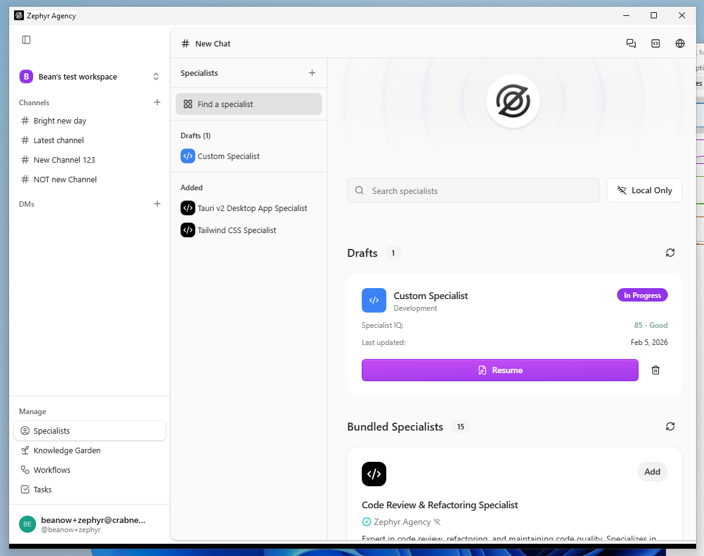
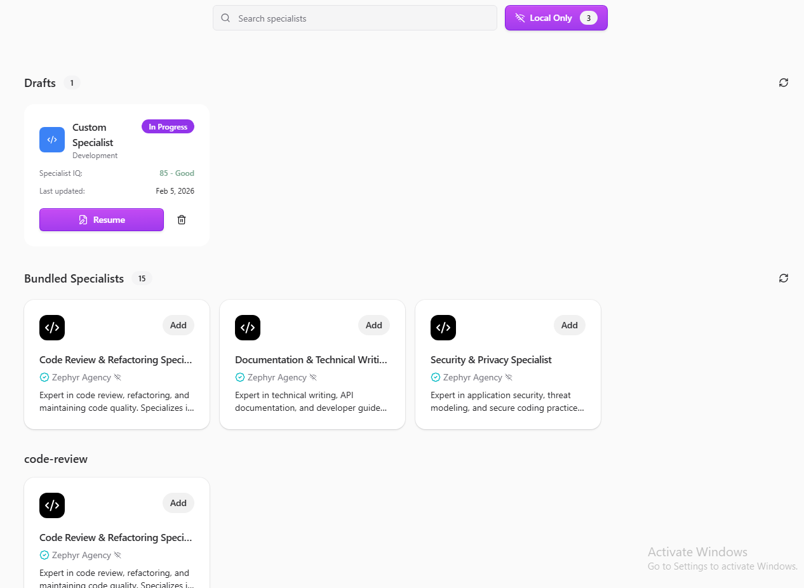
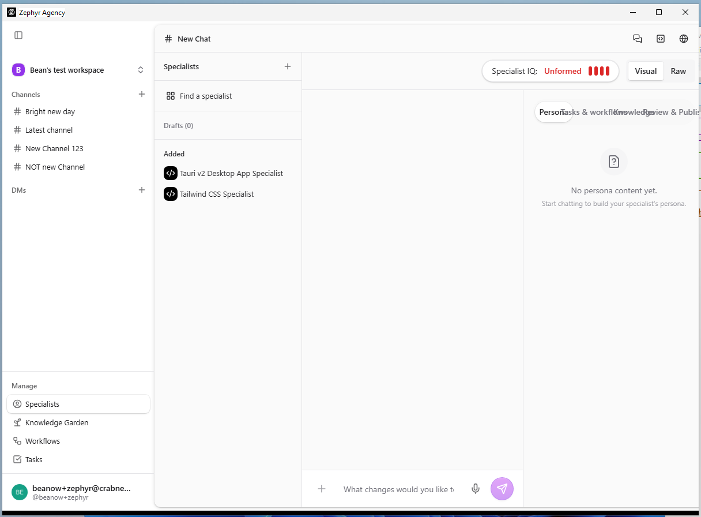
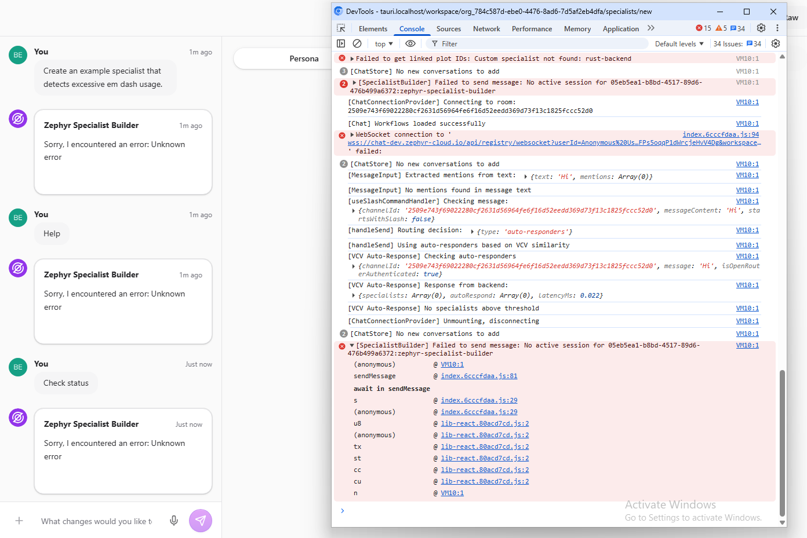

|                 |                 |
|-----------------|-----------------|
| **Tester Name** | Robin van Boven |
| **Role**        | Senior Engineer |
| **Platform**    | Windows 11      |
| **Date**        | Feb 6th, 2026   |

# Step 4: Specialists

*AI specialist configuration, templates, search and filtering*

|                   |               |
|-------------------|---------------|
| **Area**          | /specialists  |
| **Pre-condition** | Authenticated |

**SPEC-01: Page Load**

**Pre-condition:** *Authenticated, on any page*

|  |  |  |  |
|:--:|:--:|:--:|:--:|
| **Step** | **Action** | **Expected** | **Result** |
| 1 | Click "Specialists" in sidebar Manage section | URL shows /specialists | OK |
| 2 | Observe page header | Shows "Specialists" with + button | FAIL |
| 3 | Observe main content area | Shows specialist list or empty state | OK |
| 4 | Observe sidebar | "Find a specialist" link visible | OK |

**Notes:**

<table>
<colgroup>
<col style="width: 100%" />
</colgroup>
<tbody>
<tr>
<td>
The title says “# New Chat” 
While Specialists is in the secondary sidebar.

</td>
</tr>
</tbody>
</table>

**SPEC-02: Empty State**

**Pre-condition:** *On /specialists, no specialists created*

|  |  |  |  |
|:--:|:--:|:--:|:--:|
| **Step** | **Action** | **Expected** | **Result** |
| 1 | Observe main content area | "Bundled Specialists" section visible | OK |
| 2 | Observe bundled count | Shows count or "No bundled specialists found" | OK |
| 3 | Observe loading message | May show "They may still be loading" | OK |

**Notes:**

|     |
|-----|
|     |

**SPEC-03: Search Input**

**Pre-condition:** *On /specialists, at least one specialist exists*

<table>
<colgroup>
<col style="width: 8%" />
<col style="width: 39%" />
<col style="width: 37%" />
<col style="width: 14%" />
</colgroup>
<tbody>
<tr>
<td style="text-align: center;"><strong>Step</strong></td>
<td style="text-align: center;"><strong>Action</strong></td>
<td style="text-align: center;"><strong>Expected</strong></td>
<td style="text-align: center;"><strong>Result</strong></td>
</tr>
<tr>
<td style="text-align: center;">1</td>
<td style="text-align: left;">Locate search input</td>
<td style="text-align: left;">Input with placeholder "Search specialists"</td>
<td style="text-align: left;">OK</td>
</tr>
<tr>
<td style="text-align: center;">2</td>
<td style="text-align: left;">Note current specialist count</td>
<td style="text-align: left;">Record how many specialists visible</td>
<td style="text-align: left;">1 Draft 
15 Bundled</td>
</tr>
<tr>
<td style="text-align: center;">3</td>
<td style="text-align: left;">Click into search input</td>
<td style="text-align: left;">Cursor appears, input focused</td>
<td style="text-align: left;">OK</td>
</tr>
<tr>
<td style="text-align: center;">4</td>
<td style="text-align: left;">Type a partial name of existing specialist</td>
<td style="text-align: left;">Text appears in input</td>
<td style="text-align: left;">OK</td>
</tr>
<tr>
<td style="text-align: center;">5</td>
<td style="text-align: left;">Observe filtering</td>
<td style="text-align: left;">Matching specialists remain visible</td>
<td style="text-align: left;">OK</td>
</tr>
<tr>
<td style="text-align: center;">6</td>
<td style="text-align: left;">Verify non-matching items disappear</td>
<td style="text-align: left;">List shows only matching results, count reduced</td>
<td style="text-align: left;">OK</td>
</tr>
<tr>
<td style="text-align: center;">7</td>
<td style="text-align: left;">Type "xyznonexistent123"</td>
<td style="text-align: left;">Nonsense search term entered</td>
<td style="text-align: left;">OK</td>
</tr>
<tr>
<td style="text-align: center;">8</td>
<td style="text-align: left;">Observe empty result</td>
<td style="text-align: left;">"No specialists found" or empty list</td>
<td style="text-align: left;">OK</td>
</tr>
<tr>
<td style="text-align: center;">9</td>
<td style="text-align: left;">Clear search input</td>
<td style="text-align: left;">Full list restored, original count matches</td>
<td style="text-align: left;">OK</td>
</tr>
</tbody>
</table>

**Notes:**

|                                                      |
|------------------------------------------------------|
| Using “Zephyr” as search filter matches all of them. |

**SPEC-04: Local Only Toggle**

**Pre-condition:** *On /specialists*

|  |  |  |  |
|:--:|:--:|:--:|:--:|
| **Step** | **Action** | **Expected** | **Result** |
| 1 | Locate "Local Only" toggle/button | Button with WiFi-strike icon near search | OK |
| 2 | Observe current state | Shows current filter state | OK |
| 3 | Click toggle | Button changes appearance when active | OK |
| 4 | Observe list | List updates based on filter | FAIL |
| 5 | Click toggle again | Returns to inactive state | OK |

**Notes:**

<table>
<colgroup>
<col style="width: 100%" />
</colgroup>
<tbody>
<tr>
<td>
List counts are incorrect.

Button says 3. Actually 6+1 custom 
“Bundled Specialists” category says 15 but actually 3.
</td>
</tr>
</tbody>
</table>

**SPEC-05: Find a Specialist**

**Pre-condition:** *On /specialists*

|  |  |  |  |
|:--:|:--:|:--:|:--:|
| **Step** | **Action** | **Expected** | **Result** |
| 1 | Locate "Find a specialist" link/button | Button or link visible | OK |
| 2 | Click "Find a specialist" | Discovery view or modal opens | OK |
| 3 | Observe content | Specialist discovery interface shown | OK |

**Notes:**

|     |
|-----|
|     |

**SPEC-06: Create Specialist Button**

**Pre-condition:** *On /specialists*

|  |  |  |  |
|:--:|:--:|:--:|:--:|
| **Step** | **Action** | **Expected** | **Result** |
| 1 | Locate create button (+ icon in header) | Button visible in Specialists header | OK |
| 2 | Click create button | "Create a Specialist" view opens | FAIL |
| 3 | Observe "Recommended" dropdown | Shows "Recommended 4" with category options | FAIL |
| 4 | Observe "Browse templates by category" | Category filter buttons visible | FAIL |
| 5 | Click a category | Category highlights, templates filter | FAIL |
| 6 | Locate "Clear filters" button | Button to reset all filters | FAIL |
| 7 | Observe natural language input at bottom | Text input to "describe a specialist task" | FAIL |

**Notes:**

<table>
<colgroup>
<col style="width: 100%" />
</colgroup>
<tbody>
<tr>
<td>Immediately goes to a blank Specialist view with chat prompt sidebar. 
This view also does not support narrow window sizes. 
</td>
</tr>
</tbody>
</table>

**SPEC-07: Clear Filters**

**Pre-condition:** *On /specialists, in Create Specialist view with filters applied*

|  |  |  |  |
|:--:|:--:|:--:|:--:|
| **Step** | **Action** | **Expected** | **Result** |
| 1 | Apply a category filter (click a category) | Category highlighted, list filtered | BLOCK |
| 2 | Locate "Clear filters" button | Button visible | BLOCK |
| 3 | Click "Clear filters" | All filters reset | BLOCK |
| 4 | Verify both filters cleared | Recommended dropdown AND category buttons both reset | BLOCK |

**Notes:**

|                                                             |
|-------------------------------------------------------------|
| There’s nothing related to categories or filters on screen. |

**SPEC-08: Specialist Selection**

**Pre-condition:** *On /specialists, at least one specialist exists*

|  |  |  |  |
|:--:|:--:|:--:|:--:|
| **Step** | **Action** | **Expected** | **Result** |
| 1 | Locate a specialist in the list | Specialist card/row visible | OK |
| 2 | Click on specialist | Detail view opens or specialist selected | OK |
| 3 | Observe specialist details | Name, description, model info shown | OK |

**Notes:**

|     |
|-----|
|     |

# General Notes and Observations

*Record any overall impressions, patterns, or issues noticed during testing.*

|  |
|----|
| The specialist builder chat also seems to fail. |
