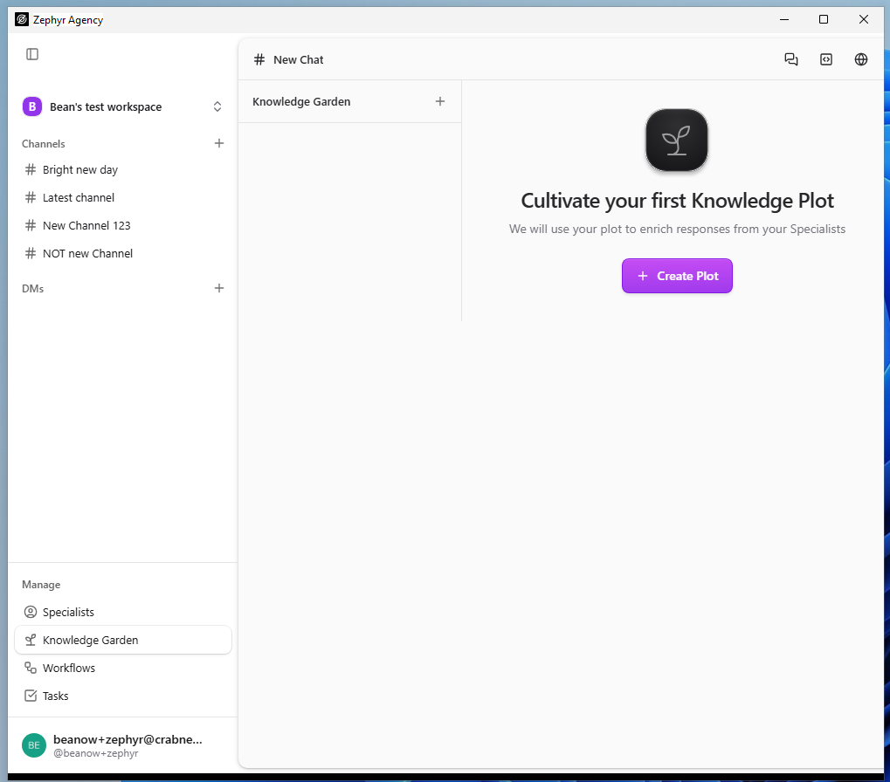
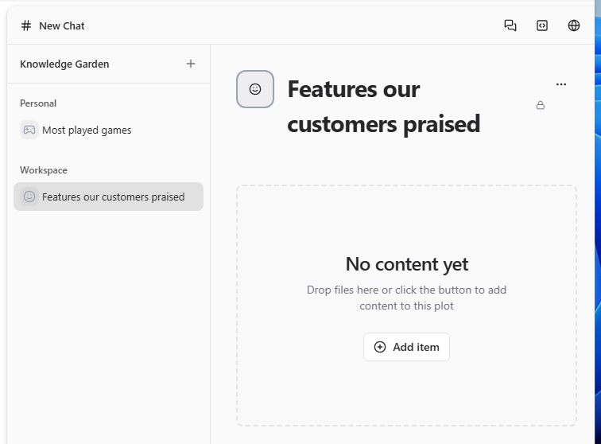
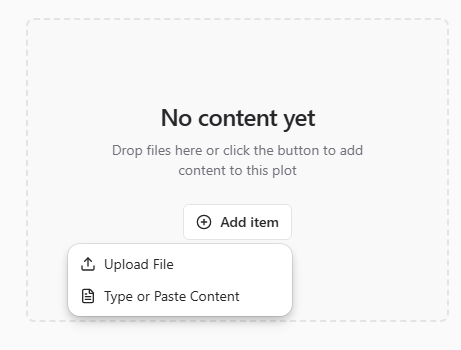
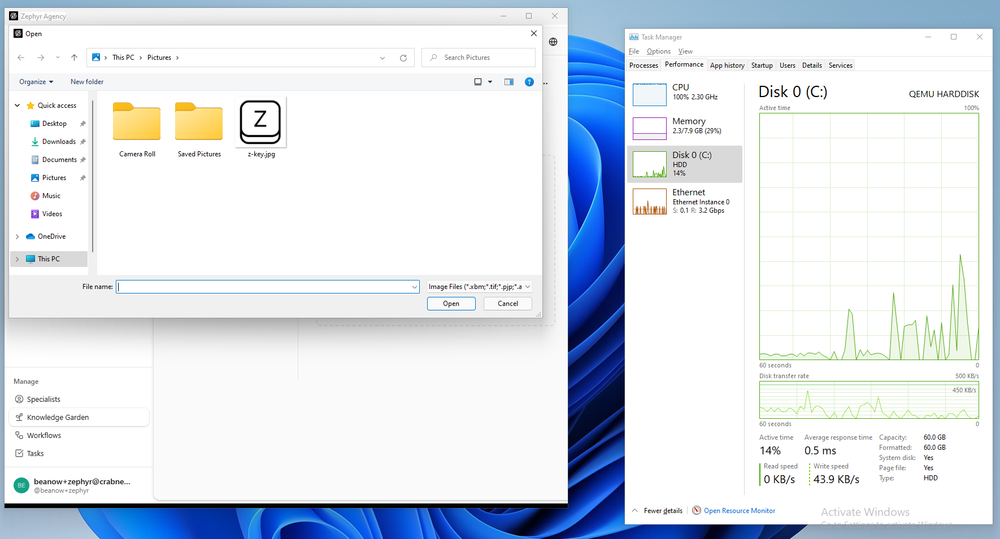
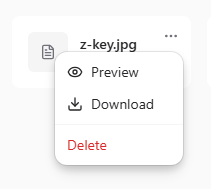

|                 |                 |
|-----------------|-----------------|
| **Tester Name** | Robin van Boven |
| **Role**        | Senior Engineer |
| **Platform**    | Windows 11      |
| **Date**        | Feb 6th, 2026   |

# Step 5: Knowledge Garden

*Knowledge plots, file uploads, document management*

|                   |               |
|-------------------|---------------|
| **Area**          | /knowledge    |
| **Pre-condition** | Authenticated |

**KNOW-01: Page Load**

**Pre-condition:** *Authenticated, on any page*

|  |  |  |  |
|:--:|:--:|:--:|:--:|
| **Step** | **Action** | **Expected** | **Result** |
| 1 | Click "Knowledge Garden" in sidebar Manage section | URL shows /knowledge | OK |
| 2 | Observe page header | Shows "Knowledge Garden" with + button | FAIL |
| 3 | Observe main content area | Shows plot list or empty state | OK |

**Notes:**

<table>
<colgroup>
<col style="width: 100%" />
</colgroup>
<tbody>
<tr>
<td>The title says “# New Chat” 
While Knowledge Garden is in the secondary sidebar. 
Icon has improper transparency. (White artifacts around the rounded corners.)</td>
</tr>
</tbody>
</table>

**KNOW-02: Empty State**

**Pre-condition:** *On /knowledge, no plots created*

|  |  |  |  |
|:--:|:--:|:--:|:--:|
| **Step** | **Action** | **Expected** | **Result** |
| 1 | Observe main content area | Seedling/plant icon visible | OK |
| 2 | Observe heading | "Cultivate your first Knowledge Plot" | OK |
| 3 | Observe description | "We will use your plot to enrich responses from your Specialists" | OK |
| 4 | Observe CTA button | "Create Plot" button visible (purple) | OK |

**Notes:**

|     |
|-----|
|     |

**KNOW-03: Create Plot — Header Button**

**Pre-condition:** *On /knowledge*

|  |  |  |  |
|:--:|:--:|:--:|:--:|
| **Step** | **Action** | **Expected** | **Result** |
| 1 | Locate create button (+ icon in header) | Button with aria-label "Create new plot" | OK |
| 2 | Click create button | Creation form or modal opens | OK |
| 3 | Observe form | Plot configuration options shown | OK |

**Notes:**

|     |
|-----|
|     |

**KNOW-04: Create Plot — CTA Button**

**Pre-condition:** *On /knowledge, empty state showing*

|  |  |  |  |
|:--:|:--:|:--:|:--:|
| **Step** | **Action** | **Expected** | **Result** |
| 1 | Locate "Create Plot" CTA button | Purple button with + icon in empty state | OK |
| 2 | Click button | Category selection appears | OK |
| 3 | Observe categories | "Personal" and "Workspaces" options | OK |
| 4 | Select a category | Name input appears | OK |
| 5 | Enter plot name and confirm | Plot created | OK |

**Notes:**

|     |
|-----|
|     |

**KNOW-05: Plot Creation Form**

**Pre-condition:** *Create plot form open*

|  |  |  |  |
|:--:|:--:|:--:|:--:|
| **Step** | **Action** | **Expected** | **Result** |
| 1 | Observe category selection | Personal and Workspaces options | OK |
| 2 | Select category | Category selected | OK |
| 3 | Observe name field | Text input for plot name | OK |
| 4 | Enter name and submit | Plot created, detail view opens | OK |

**Notes:**

|     |
|-----|
|     |

**KNOW-06: Plot List Display**

**Pre-condition:** *On /knowledge, at least one plot exists*

|  |  |  |  |
|:--:|:--:|:--:|:--:|
| **Step** | **Action** | **Expected** | **Result** |
| 1 | Observe sidebar categories | "Personal" and "Workspaces" sections with counts | FAIL |
| 2 | Observe plots under each category | Plot names listed under their category | OK |
| 3 | Click on a plot | Plot detail view opens | OK |

**Notes:**

|  |
|----|
| There are no counts. |

**KNOW-07: Plot Detail View**

**Pre-condition:** *Plot selected*

|  |  |  |  |
|:--:|:--:|:--:|:--:|
| **Step** | **Action** | **Expected** | **Result** |
| 1 | Observe plot header | Plot name shown | OK |
| 2 | Observe empty state | "No items added" with drag-drop area | FAIL |
| 3 | Locate "Add item" dropdown | Dropdown with File and Folder options | OK |
| 4 | Click "Add item" | Shows File or Folder upload options | FAIL |

**Notes:**

|  |
|----|
| Caption and options are different. |

\
=

# General Notes and Observations

*Record any overall impressions, patterns, or issues noticed during testing.*

<table>
<colgroup>
<col style="width: 100%" />
</colgroup>
<tbody>
<tr>
<td>
Pressing Upload File (before choosing something to upload), causes high disk utilization. 
Takes around a full minute to open the file dialog for the first time.

The preview option does nothing.
</td>
</tr>
</tbody>
</table>
