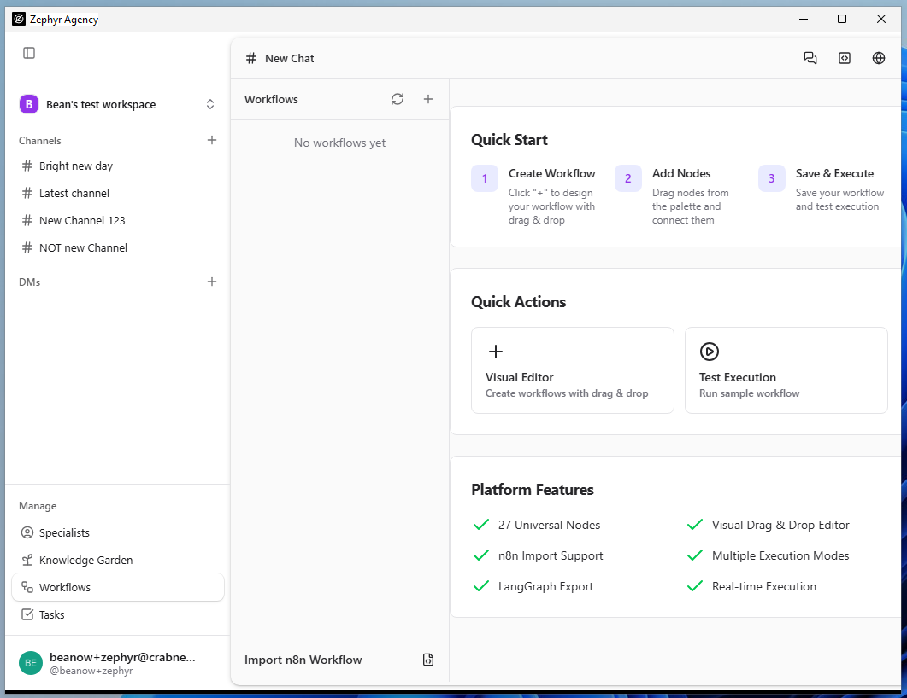
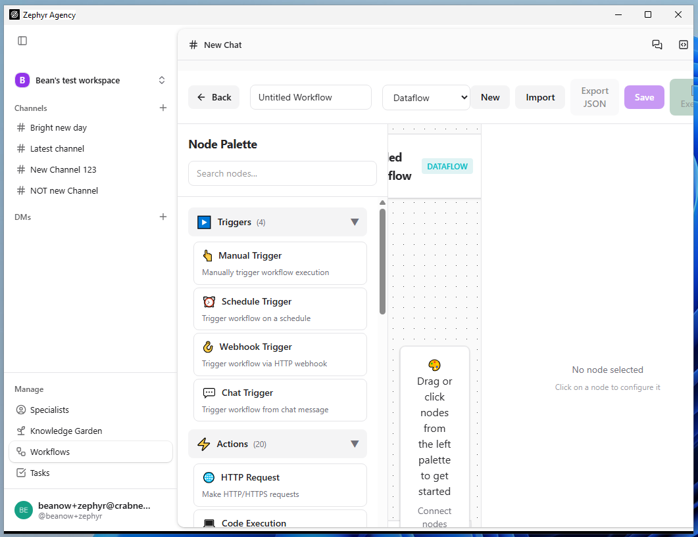
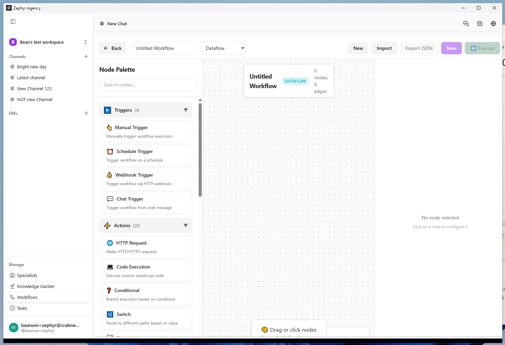
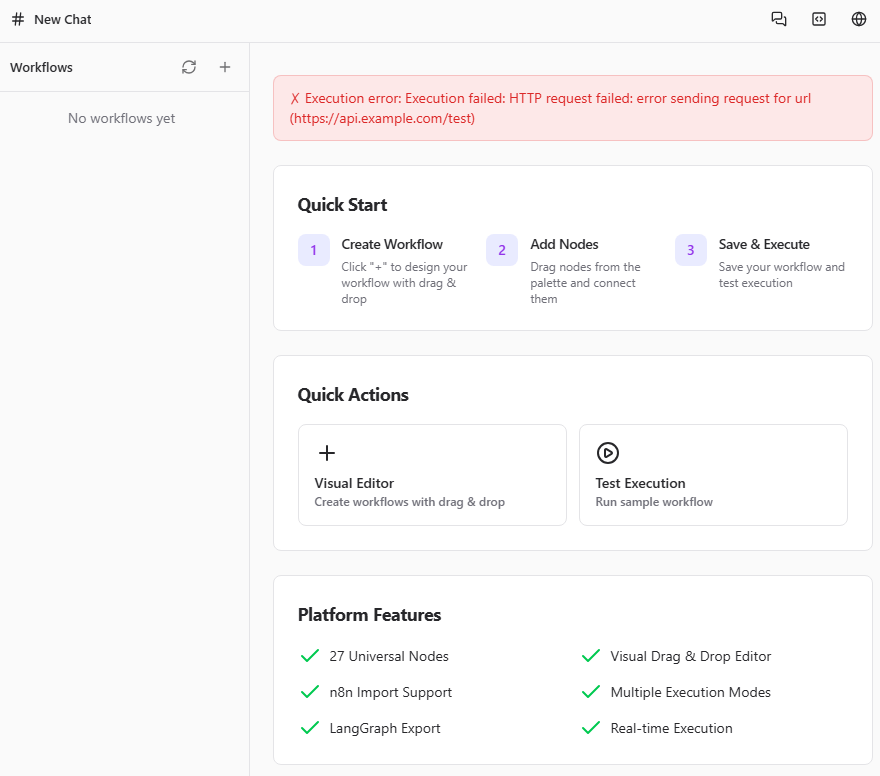
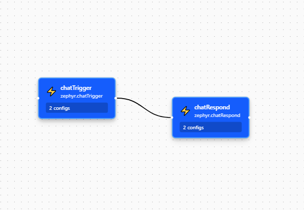
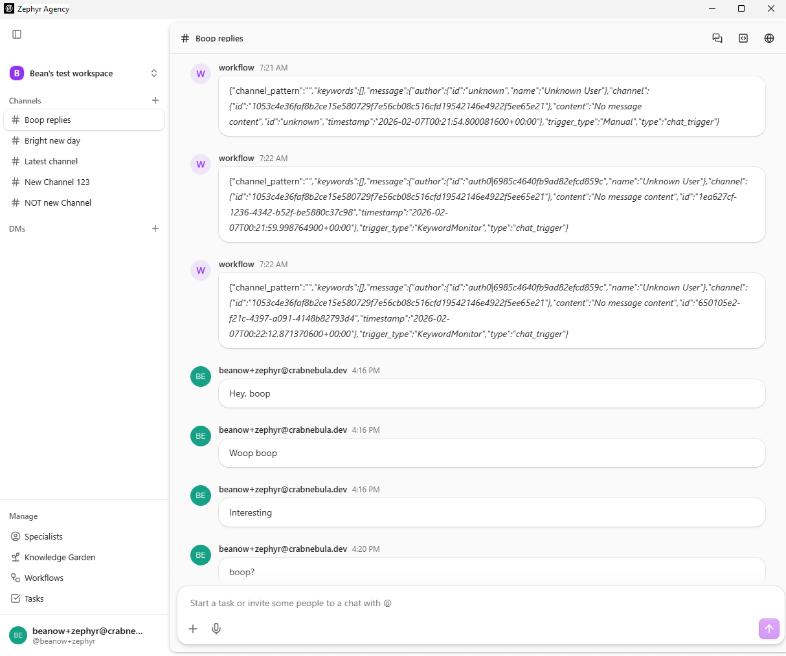

|                 |                 |
|-----------------|-----------------|
| **Tester Name** | Robin van Boven |
| **Role**        | Senior Engineer |
| **Platform**    | Windows 11      |
| **Date**        | Feb 6th, 2026   |

# Step 6: Workflows

*Visual workflow editor, n8n import, execution*

***Note: The URL is /workflow (singular), not /workflows.***

|                   |               |
|-------------------|---------------|
| **Area**          | /workflow     |
| **Pre-condition** | Authenticated |

**WORK-01: Page Load**

**Pre-condition:** *Authenticated, on any page*

|  |  |  |  |
|:--:|:--:|:--:|:--:|
| **Step** | **Action** | **Expected** | **Result** |
| 1 | Click "Workflows" in sidebar Manage section | URL shows /workflow (singular) | OK |
| 2 | Observe page header | Shows "Workflows" with refresh and + buttons | FAIL |
| 3 | Observe main content area | Shows workflow list or empty state with Quick Start | OK |

**Notes:**

<table>
<colgroup>
<col style="width: 100%" />
</colgroup>
<tbody>
<tr>
<td>
The title says “# New Chat” 
While Knowledge Garden is in the secondary sidebar.

</td>
</tr>
</tbody>
</table>

**WORK-02: Empty State**

**Pre-condition:** *On /workflow, no workflows created*

|          |                           |                             |            |
|:--------:|:-------------------------:|:---------------------------:|:----------:|
| **Step** |        **Action**         |        **Expected**         | **Result** |
|    1     |    Observe left panel     | "No workflows yet" message  |     OK     |
|    2     |    Observe right panel    | "Quick Start" guide visible |     OK     |
|    3     | Observe Quick Start steps |   3 numbered steps shown    |     OK     |

**Notes:**

|     |
|-----|
|     |

**WORK-03: Quick Start Guide**

**Pre-condition:** *On /workflow, empty state showing*

|  |  |  |  |
|:--:|:--:|:--:|:--:|
| **Step** | **Action** | **Expected** | **Result** |
| 1 | Read step 1 | "Create Workflow" — Click + to design your workflow with drag & drop | OK |
| 2 | Read step 2 | "Add Nodes" — Drag nodes from the palette and connect them | OK |
| 3 | Read step 3 | "Save & Execute" — Save your workflow and test execution | OK |

**Notes:**

|     |
|-----|
|     |

**WORK-04: Quick Actions**

**Pre-condition:** *On /workflow*

|  |  |  |  |
|:--:|:--:|:--:|:--:|
| **Step** | **Action** | **Expected** | **Result** |
| 1 | Locate "Quick Actions" section | Section header visible | OK |
| 2 | Locate "Visual Editor" button | Button with + icon, "Create workflows" description | OK |
| 3 | Locate "Test Execution" button | Button with play icon, "Run sample workflow" description | OK |

**Notes:**

|     |
|-----|
|     |

**WORK-05: Visual Editor Launch**

**Pre-condition:** *On /workflow*

|  |  |  |  |
|:--:|:--:|:--:|:--:|
| **Step** | **Action** | **Expected** | **Result** |
| 1 | Click "Visual Editor" button | Editor opens | OK |
| 2 | Observe migration prompt | "Enable Collaborative Editing" dialog may appear | OK |
| 3 | Dismiss or accept prompt | Click "Skip for Now" or "Migrate Now" | OK |
| 4 | Observe toolbar | Back, name field, Dataflow dropdown, New, Import, Export JSON, Save, Execute | OK |
| 5 | Observe Node Palette (left) | Triggers (4), Actions (20) categories | OK |
| 6 | Observe canvas (center) | "Drag or click nodes from the left" | FAIL |
| 7 | Locate Back button (top-left) | ← Back returns to workflow list | OK |

**Notes:**

<table>
<colgroup>
<col style="width: 100%" />
</colgroup>
<tbody>
<tr>
<td>
On small windows layout breaks. 
 
On large windows the “Drag or click nodes…” instruction goes off screen.

</td>
</tr>
</tbody>
</table>

**WORK-06: Test Execution**

**Pre-condition:** *On /workflow*

|  |  |  |  |
|:--:|:--:|:--:|:--:|
| **Step** | **Action** | **Expected** | **Result** |
| 1 | Click "Test Execution" button | Execution runs | FAIL |
| 2 | Observe result | Error banner or success message | OK |

**Notes:**

|  |
|----|
|  |

**WORK-07: Import n8n Workflow**

**Pre-condition:** *On /workflow*

|  |  |  |  |
|:--:|:--:|:--:|:--:|
| **Step** | **Action** | **Expected** | **Result** |
| 1 | Locate "Import n8n Workflow" section | Section with JSON textarea visible | OK |
| 2 | Observe textarea placeholder | Shows {"name": "Workflow", "nodes": \[...\]} | OK |
| 3 | Paste sample n8n JSON (see test fixtures) | JSON appears in textarea | BLOCK |
| 4 | Click "Import n8n" button (purple) | Import processes | BLOCK |
| 5 | Observe result | Workflow created or validation error | BLOCK |

**Notes:**

|                                           |
|-------------------------------------------|
| Don’t have an n8n json fixture available. |

**WORK-08: Create Workflow — Header Button**

**Pre-condition:** *On /workflow*

|  |  |  |  |
|:--:|:--:|:--:|:--:|
| **Step** | **Action** | **Expected** | **Result** |
| 1 | Locate + button in header | Create button near "Workflows" title | OK |
| 2 | Click + button | New workflow creation starts | OK |
| 3 | Observe result | Editor opens or creation form shown | OK |

**Notes:**

|     |
|-----|
|     |

**WORK-09: Refresh Workflows**

**Pre-condition:** *On /workflow*

|  |  |  |  |
|:--:|:--:|:--:|:--:|
| **Step** | **Action** | **Expected** | **Result** |
| 1 | Locate refresh button in header | Refresh/reload icon | OK |
| 2 | Click refresh button | List refreshes | OK |
| 3 | Observe success message | Green dialog shows "Loaded X workflows" | OK |

**Notes:**

|     |
|-----|
|     |

**WORK-10: Workflow List**

**Pre-condition:** *On /workflow, at least one workflow exists*

|  |  |  |  |
|:--:|:--:|:--:|:--:|
| **Step** | **Action** | **Expected** | **Result** |
| 1 | Observe workflow list in left panel | Workflow items visible | OK |
| 2 | Observe workflow item info | Name, possibly status/date | OK |
| 3 | Click on a workflow | Workflow selected, details shown | OK |

**Notes:**

|     |
|-----|
|     |

# General Notes and Observations

*Record any overall impressions, patterns, or issues noticed during testing.*

<table>
<colgroup>
<col style="width: 100%" />
</colgroup>
<tbody>
<tr>
<td>
Nodes have incorrect icon &amp; color after reloading. 

Replies from a workflow have wrong timestamps and appear out of order.

The message header says ~7 AM (I’m in UTC+1) 
The content says midnight. 
The actual time it was generated was ~4PM.
</td>
</tr>
</tbody>
</table>
