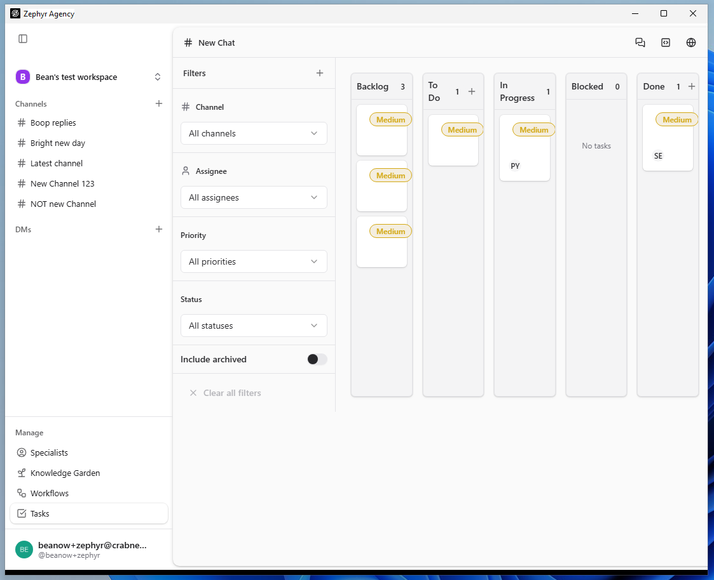
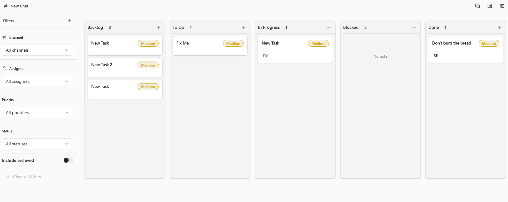
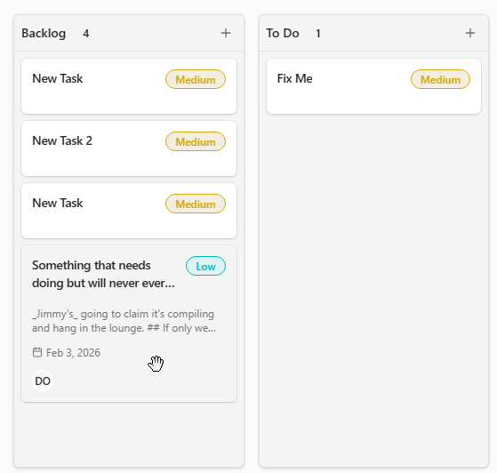
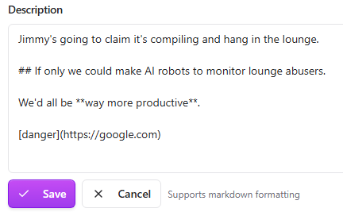

|                 |                 |
|-----------------|-----------------|
| **Tester Name** | Robin van Boven |
| **Role**        | Senior Engineer |
| **Platform**    | Windows 11      |
| **Date**        | Feb 6th, 2026   |

# Step 7: Tasks

*Kanban board, task management, drag and drop, persistence*

|                   |               |
|-------------------|---------------|
| **Area**          | /tasks        |
| **Pre-condition** | Authenticated |

**TASK-01: Page Load**

**Pre-condition:** *Authenticated, on any page*

|  |  |  |  |
|:--:|:--:|:--:|:--:|
| **Step** | **Action** | **Expected** | **Result** |
| 1 | Click "Tasks" in sidebar Manage section | URL shows /tasks | OK |
| 2 | Observe page layout | Kanban board visible | OK |
| 3 | Count visible columns | 5 columns | OK |

**Notes:**

|                       |
|-----------------------|
| Title is “# New Chat” |

**TASK-02: Kanban Columns**

**Pre-condition:** *On /tasks*

|          |                           |                          |            |
|:--------:|:-------------------------:|:------------------------:|:----------:|
| **Step** |        **Action**         |       **Expected**       | **Result** |
|    1     | Read first column header  |   "Backlog" with count   |     OK     |
|    2     | Read second column header |    "To Do" with count    |     OK     |
|    3     | Read third column header  | "In Progress" with count |     OK     |
|    4     | Read fourth column header |   "Blocked" with count   |     OK     |
|    5     | Read fifth column header  |    "Done" with count     |     OK     |

**Notes:**

|  |
|----|
| Does not fit smaller window sizes. |

**TASK-03: Empty State**

**Pre-condition:** *On /tasks, no tasks created*

|  |  |  |  |
|:--:|:--:|:--:|:--:|
| **Step** | **Action** | **Expected** | **Result** |
| 1 | Observe column counts | All columns show "0" | FAIL |
| 2 | Observe column content | "No tasks" message in each column | FAIL |

**Notes:**

|  |
|----|
| There are already tasks there. |

**TASK-04: Create Task**

**Pre-condition:** *On /tasks*

|  |  |  |  |
|:--:|:--:|:--:|:--:|
| **Step** | **Action** | **Expected** | **Result** |
| 1 | Note current task count in target column (e.g., Backlog) | Record count (e.g., "0") | 3 |
| 2 | Locate way to create task | \+ button, "Add task" link, or click in column | OK |
| 3 | Trigger task creation | Form or inline editor appears | OK |
| 4 | Observe task form | Title field minimum | OK |
| 5 | Enter task title "Test task" | Text entered | OK |
| 6 | Save task | Task appears in appropriate column | OK |
| 7 | Verify column header count increments | Count now shows +1 | OK |

**Notes:**

|                                                     |
|-----------------------------------------------------|
| Column count increments *before* the task is saved. |

**TASK-05: Task Card Display**

**Pre-condition:** *On /tasks, at least one task exists*

|  |  |  |  |
|:--:|:--:|:--:|:--:|
| **Step** | **Action** | **Expected** | **Result** |
| 1 | Locate task card in column | Task visible as card | OK |
| 2 | Observe card content | Task title visible | OK |
| 3 | Observe additional info | May show assignee, date, tags | FAIL |

**Notes:**

|  |
|----|
| Description renders raw markdown. |

**TASK-06: Task Drag and Drop**

**Pre-condition:** *On /tasks, at least one task exists*

|  |  |  |  |
|:--:|:--:|:--:|:--:|
| **Step** | **Action** | **Expected** | **Result** |
| 1 | Note which column the task is in | Record source column | Backlog |
| 2 | Click and hold on task card | Card becomes draggable | OK |
| 3 | Drag to different column | Visual feedback shows target | OK |
| 4 | Release card | Card moves to new column | FAIL |
| 5 | Observe column counts | Source −1, target +1 | FAIL |

**Notes:**

|                     |
|---------------------|
| Card does not move. |

**TASK-07: Task Detail View**

**Pre-condition:** *On /tasks, at least one task exists*

|          |                      |                                    |            |
|:--------:|:--------------------:|:----------------------------------:|:----------:|
| **Step** |      **Action**      |            **Expected**            | **Result** |
|    1     |  Click on task card  |     Detail view or modal opens     |     OK     |
|    2     | Observe task details | Title, description, status visible |     OK     |
|    3     | Locate edit options  |   Edit button or inline editing    |     OK     |
|    4     | Locate close option  |   Close button or click outside    |     OK     |
|    5     |  Close detail view   |       Returns to kanban view       |     OK     |

**Notes:**

|     |
|-----|
|     |

**TASK-08: Task Edit**

**Pre-condition:** *Task detail view open*

|          |                    |                      |            |
|:--------:|:------------------:|:--------------------:|:----------:|
| **Step** |     **Action**     |     **Expected**     | **Result** |
|    1     | Locate title field | Current title shown  |     OK     |
|    2     |     Edit title     | Field accepts input  |     OK     |
|    3     |    Save changes    | Updated title saved  |     OK     |
|    4     |   Verify change    | Task shows new title |     OK     |

**Notes:**

|     |
|-----|
|     |

**TASK-09: Task Delete**

**Pre-condition:** *Task detail view open*

|  |  |  |  |
|:--:|:--:|:--:|:--:|
| **Step** | **Action** | **Expected** | **Result** |
| 1 | Locate delete option | Delete button or menu item | FAIL |
| 2 | Click delete | Confirmation prompt may appear | FAIL |
| 3 | Confirm delete (if prompted) | Task removed | FAIL |
| 4 | Observe column | Task no longer visible | FAIL |

**Notes:**

|  |
|----|
| There’s no delete option. But there is archive. Which hides the task, but can be restored. |

**TASK-10: Task Persistence (Local-First Validation)**

**Pre-condition:** *On /tasks, task has been moved via drag-drop (TASK-06)*

|  |  |  |  |
|:--:|:--:|:--:|:--:|
| **Step** | **Action** | **Expected** | **Result** |
| 1 | Note current task position (which column) | Record column name | OK |
| 2 | Reload page (Cmd+R or browser refresh) | Page reloads | FAIL |
| 3 | Navigate back to /tasks if needed | Tasks page loads | OK |
| 4 | Verify task remains in new column | Task position persisted, not reverted | OK |
| 5 | Verify column counts are correct | Counts match pre-reload state | OK |

**Notes:**

<table>
<colgroup>
<col style="width: 100%" />
</colgroup>
<tbody>
<tr>
<td>
Tasks do not load while offline. 
1. Create several tasks while online. 
2. Disconnect network. 
3. Edit tasks. 
4. Ctrl+R (reload on windows) while still offline. 
5. Notice all tasks are gone. 
6. Reconnect network. 
7. Tasks do not automatically restore.

8. Either reload, or navigate back and forth, to show tasks again. 
9. Note the edits from step 3 persisted.
</td>
</tr>
</tbody>
</table>

# General Notes and Observations

*Record any overall impressions, patterns, or issues noticed during testing.*

<table>
<colgroup>
<col style="width: 100%" />
</colgroup>
<tbody>
<tr>
<td>
Description markdown <strong>is not sanitized</strong>. 
This is a security vulnerability.

Tasks are also the same across all workspaces.
</td>
</tr>
</tbody>
</table>
